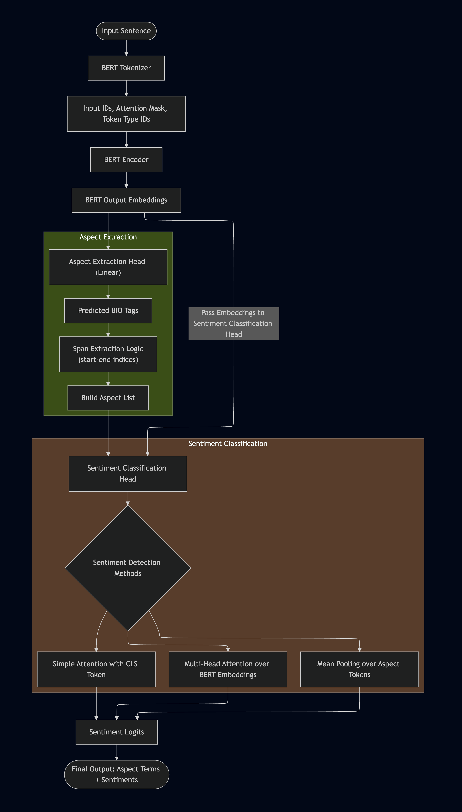

## Introduction

Ever found yourself in a product manager's shoes at a tech company, grappling with mountains of unstructured customer reviews after a new launch? You're not just looking for a 'happy or sad' tally; you want to pinpoint exactly *what* customers love or loathe. So, what's your next move? Standard sentiment analysis often falls short, giving you a high-level 'happy or sad' score but missing the granular insights you truly need.

This is precisely where **Aspect-Based Sentiment Analysis (ABSA)** shines.

Think of Aspect-Based Sentiment Analysis as a precision tool: it lets you drill down into customer reviews to extract specific product or service aspects and then determine the sentiment tied to each one. For example, if you have a review that says "The battery life is great, but the camera quality is terrible," Aspect-Based Sentiment Analysis would allow you to identify "battery life" as an aspect with positive sentiment and "camera quality" as an aspect with negative sentiment.

### Why is Aspect-Based Sentiment Analysis Important?

ABSA moves you beyond a generic 'happy or unhappy' score, empowering you to pinpoint *exactly* which features customers adore or despise. This granular insight is invaluable for making data-driven decisions, whether you're prioritizing product improvements, crafting marketing campaigns, or refining customer support strategies. By analyzing customer reviews over time, you can also track whether sentiment towards specific aspects is improving or declining, which in turn helps you make informed decisions about product development and marketing strategies.

## Project Overview and Challenges

The core challenge I faced in this project stemmed from its inherently multi-stage nature. Typically, to achieve Aspect-Based Sentiment Analysis, you'd perform two distinct tasks: first, extracting the aspects from the reviews, and then determining the sentiment associated with each extracted aspect. This proved particularly challenging because, in real-world scenarios, explicit aspect labels are rarely available within raw review texts.

### Tech Stack

- **Python**: The primary programming language used for the project.
- **PyTorch**: The deep learning framework used for building and training the model.
- **Transformers**: The Hugging Face library used for pre-trained BERT models.
- **Polars & Pandas**: The library used for data manipulation and analysis.

### Why Use BERT?

Traditional models look at words in isolation, but BERT understands the context of each word in a sentence. This helps it identify aspects and their sentiments more accurately, especially when the same word can mean different things in different contexts. Its pre-training on vast amounts of text data makes it incredibly powerful for a wide range of NLP tasks, including this complex multi-task ABSA problem.

### Initial Approach: Multi-Step Analysis

My initial approach involved a classic two-stage pipeline: first, I extracted aspects from reviews using one pre-trained BERT model, and *then* I employed a separate pre-trained BERT model to classify the sentiment of each identified aspect.

While this approach was effective, it came with notable drawbacks: significant processing time, a need for substantial manual optimization, and an increased project complexity owing to the deployment of two distinct models.

### Moving Towards a Single-Step Approach

To overcome these limitations, I then explored a **single-step approach**. The goal was to use a single pre-trained BERT model to simultaneously extract aspects and their associated sentiment, offering a simpler and faster alternative to the multi-step methodology. This streamlined process, while requiring a more complex architecture and potentially more training data, promised significant efficiency gains.

## Neural Network Pipeline



### How Does the Model Work?

1. The review text is split into tokens (words or subwords).
2. Each token is converted to an ID and passed to BERT, a language model that understands context.
3. BERT outputs a representation for each token.
4. The first head (aspect extraction) predicts which tokens are part of an aspect (using BIO tags).
5. For each detected aspect, the second head (sentiment classifier) predicts if the sentiment is positive, negative, or neutral.

## Dataset

The dataset used in this project is the SemEval 2014 Task 4 dataset, which contains customer reviews of laptops. The dataset is divided into three parts: the training set, the test set, and the validation set.
The dataset is available on the [SemEval website](https://alt.qcri.org/semeval2014/task4/). The dataset is in the form of a JSONL file, with each row representing a review and its associated aspect and sentiment labels. The aspect categories include "battery", "camera", "design", "performance", and "price". The sentiment labels are "positive", "negative", and "neutral".

Below is the format of the training data.

```json
{
    "text": "now i ' m really bummed that i have a very nice looking chromebook with a beautiful screen that is totally unusable .",
    "labels": [
        {"aspect": "chromebook", "opinion": "nice", "polarity": "positive", "category": "LAPTOP#DESIGN_FEATURES"},
        {"aspect": "chromebook", "opinion": "bummed", "polarity": "negative", "category": "LAPTOP#OPERATION_PERFORMANCE"},
        {"aspect": "chromebook", "opinion": "unusable", "polarity": "negative", "category": "LAPTOP#OPERATION_PERFORMANCE"},
        {"aspect": "screen", "opinion": "beautiful", "polarity": "positive", "category": "DISPLAY#OPERATION_PERFORMANCE"}
    ]
}
```

### Dataset Preprocessing

Before feeding the data into our deep learning models, thorough preprocessing is crucial. This involved several key steps:

1. **Tokenization:** Converting text into numerical tokens that the BERT model can understand. I used the `BertTokenizer` from Hugging Face for this.
2. **Aspect Span Identification:** Identifying the start and end positions of each aspect within the tokenized sentence.
3. **Sentiment Mapping:** Converting sentiment labels (e.g., "positive", "negative") into numerical representations.
4. **Creating Masks:** Generating aspect masks to highlight the relevant tokens for each aspect during training.
5. **Padding and Truncation:** Ensuring all input sequences have a uniform length by padding shorter sequences and truncating longer ones.
6. **BIO Tagging:** Assigning BIO tags to each token in the input sequence to indicate whether it is part of an aspect or not.

#### BIO Tagging Scheme

In many NLP tasks, including aspect extraction, named entity recognition, and part-of-speech tagging, a common tagging scheme is used to label tokens in a sequence. The **BIO** (Beginning, Inside, Outside) tagging scheme is one such method. It helps identify the boundaries of entities or aspects within a text.
Once the tags are assigned, they are converted into numerical labels for model training.

<table>
    <thead>
        <tr>
            <th>Tag</th>
            <th>Meaning</th>
        </tr>
    </thead>
    <tbody>
        <tr>
            <td>B-ASP</td>
            <td>Beginning of an aspect</td>
        </tr>
        <tr>
            <td>I-ASP</td>
            <td>Inside an aspect</td>
        </tr>
        <tr>
            <td>O</td>
            <td>Outside any aspect</td>
        </tr>
    </tbody>
</table>

**Example:**

```
Text: "The battery life is great"

Tags: O O B-ASP I-ASP O O
```

Here's an example of the final preprocessed data structure for a single review:

```yaml
Tokens: ['[CLS]', 'now', 'i', "'", 'm', 'really', 'bum', '##med', 'that', 'i', 'have', 'a', 'very', 'nice', 'looking', 'chrome', '##book', 'with', 'a', 'beautiful', 'screen', 'that', 'is', 'totally', 'un', '##usa', '##ble', '.', '[SEP]', '[PAD]', '[PAD]', '[PAD]', '[PAD]', '[PAD]', '[PAD]', '[PAD]', '[PAD]', '[PAD]', '[PAD]', '[PAD]', '[PAD]', '[PAD]', '[PAD]', '[PAD]', '[PAD]', '[PAD]', '[PAD]', '[PAD]', '[PAD]', '[PAD]', '[PAD]', '[PAD]', '[PAD]', '[PAD]', '[PAD]', '[PAD]', '[PAD]', '[PAD]', '[PAD]', '[PAD]', '[PAD]', '[PAD]', '[PAD]', '[PAD]', '[PAD]', '[PAD]', '[PAD]', '[PAD]', '[PAD]', '[PAD]', '[PAD]', '[PAD]', '[PAD]', '[PAD]', '[PAD]', '[PAD]', '[PAD]', '[PAD]', '[PAD]', '[PAD]', '[PAD]', '[PAD]', '[PAD]', '[PAD]', '[PAD]', '[PAD]', '[PAD]', '[PAD]', '[PAD]', '[PAD]', '[PAD]', '[PAD]', '[PAD]', '[PAD]', '[PAD]', '[PAD]', '[PAD]', '[PAD]', '[PAD]', '[PAD]', '[PAD]', '[PAD]', '[PAD]', '[PAD]', '[PAD]', '[PAD]', '[PAD]', '[PAD]', '[PAD]', '[PAD]', '[PAD]', '[PAD]', '[PAD]', '[PAD]', '[PAD]', '[PAD]', '[PAD]', '[PAD]', '[PAD]', '[PAD]', '[PAD]', '[PAD]', '[PAD]', '[PAD]', '[PAD]', '[PAD]', '[PAD]', '[PAD]']
Input IDs: [101, 2085, 1045, 1005, 1049, 2428, 26352, 7583, 2008, 1045, 2031, 1037, 2200, 3835, 2559, 18546, 8654, 2007, 1037, 3376, 3898, 2008, 2003, 6135, 4895, 10383, 3468, 1012, 102, 0, 0, 0, 0, 0, 0, 0, 0, 0, 0, 0, 0, 0, 0, 0, 0, 0, 0, 0, 0, 0, 0, 0, 0, 0, 0, 0, 0, 0, 0, 0, 0, 0, 0, 0, 0, 0, 0, 0, 0, 0, 0, 0, 0, 0, 0, 0, 0, 0, 0, 0, 0, 0, 0, 0, 0, 0, 0, 0, 0, 0, 0, 0, 0, 0, 0, 0, 0, 0, 0, 0, 0, 0, 0, 0, 0, 0, 0, 0, 0, 0, 0, 0, 0, 0, 0, 0, 0, 0, 0, 0, 0, 0, 0, 0, 0, 0, 0, 0]
Attention Mask: [1, 1, 1, 1, 1, 1, 1, 1, 1, 1, 1, 1, 1, 1, 1, 1, 1, 1, 1, 1, 1, 1, 1, 1, 1, 1, 1, 1, 1, 0, 0, 0, 0, 0, 0, 0, 0, 0, 0, 0, 0, 0, 0, 0, 0, 0, 0, 0, 0, 0, 0, 0, 0, 0, 0, 0, 0, 0, 0, 0, 0, 0, 0, 0, 0, 0, 0, 0, 0, 0, 0, 0, 0, 0, 0, 0, 0, 0, 0, 0, 0, 0, 0, 0, 0, 0, 0, 0, 0, 0, 0, 0, 0, 0, 0, 0, 0, 0, 0, 0, 0, 0, 0, 0, 0, 0, 0, 0, 0, 0, 0, 0, 0, 0, 0, 0, 0, 0, 0, 0, 0, 0, 0, 0, 0, 0, 0, 0]
Aspect Spans: [[15, 16], [20, 20]]
Polarities: [1, 1]
Token Labels: ['O', 'O', 'O', 'O', 'O', 'O', 'O', 'O', 'O', 'O', 'O', 'O', 'O', 'O', 'B-ASP', 'I-ASP', 'O', 'O', 'O', 'B-ASP', 'O', 'O', 'O', 'O', 'O', 'O', 'O', 'O']
```

#### Explanation of the output

- **Tokens**: The input text is tokenized into individual words and sub-words. The special tokens `[CLS]` and `[SEP]` are added to the beginning and end of the sequence, respectively.
- **Input IDs**: Each token is mapped to its corresponding ID in the BERT vocabulary. Padding tokens are added to ensure that all sequences have the same length.
- **Attention Mask**: A binary mask indicating which tokens are actual words (1) and which are padding (0). This is used to ignore padding tokens during model training and evaluation.
- **Aspect Spans**: The start and end indices of the aspect tokens in the tokenized input.
- **Polarities**: The sentiment polarity associated with each aspect. In this case, both aspects have a positive polarity.
- **Token Labels**: The labels for each token in the input sequence. The aspect tokens are labeled as `B-ASP` (beginning of aspect) and `I-ASP` (inside aspect), while other tokens are labeled as `O` (outside aspect).

The code for preprocessing the data can be viewed in the following notebook. Note that code will not work as data is not available in the Google Colab environment.

[](https://colab.research.google.com/github/gautamnaik1994/Aspect-Based-Sentiment-Analysis/blob/main/notebooks/01.DataPrep.ipynb)

## Multi Step Approach

Aspect-based sentiment analysis involves a two-step process. First extract the aspects from the reviews, and then determine the sentiment associated with each extracted aspect. This is a classic two-stage pipeline approach.
In my approach, aspects were extracted from reviews using a pre-trained BERT model. Subsequently, a separate pre-trained BERT model was employed to classify the sentiment of each identified aspect. While effective, this methodology presented drawbacks including significant processing time, substantial manual optimization, and increased project complexity due to the use of two distinct models.
That is why I decided to move towards a single-step approach.

## Single Step Approach

A single pre-trained BERT model was used to simultaneously extract aspects and their associated sentiment, offering a simpler and faster alternative to multi-step approaches. This single-step method required a more complex architecture and more training data but streamlined the process. The following methods were employed to implement this approach.

### General Model Architecture

**Aspect Extraction Head**  
Because I will be extracting the aspects and determining the sentiment associated with each aspect, I will be using multi-head neural network. The first head will be used to extract the aspects. This will be powered by Bert model.  

**Sentiment Classification Head**:  
The second head will be used to determine the sentiment associated with each aspect. The output of the first head will be used as the input to the second head. The final output will be a list of aspects and their associated sentiment polarities.

I tried 3 different methods to implement the sentiment classification head. The methods are as follows:

- **Mean Pooling**
- **Multi-Head Attention**
- **Simple Attention and CLS Embedding**

I will discuss each of these methods in detail in the following sections.

<Alert title="NOTE" variant="info">
In the upcoming code snippets, I have used `mps` (Metal Performance Shaders) device for GPU acceleration. If you are using a different device, please change the device to `cuda` or `cpu` as per your requirement.
</Alert>

## Using Mean Pooling

<Aside>

### What is Mean Pooling?

Mean pooling is a technique used to aggregate the output embeddings of a sequence of tokens into a single vector representation. In the context of aspect-based sentiment analysis, mean pooling can be used to obtain a fixed-size representation for an aspect term by averaging the embeddings of the tokens that make up the aspect.

Let’s say you have the sentence:

```
The battery life of this laptop is amazing.
```

Suppose the aspect term is **"battery life"**, and its tokenized positions in the sequence are **5 and 6**.

Assume the output of your BERT model for this sentence (i.e., sequence_output) gives a hidden size of 4 for simplicity (normally it's 768). Here's what the embeddings for each token might look like:

```python
import torch

# Simulated BERT output: shape [1, seq_len=8, hidden_size=4]
sequence_output = torch.tensor([[
    [0.1, 0.2, 0.3, 0.4],  # token 0
    [0.2, 0.1, 0.0, 0.3],  # token 1
    [0.5, 0.4, 0.1, 0.2],  # token 2
    [0.3, 0.6, 0.7, 0.1],  # token 3
    [0.0, 0.0, 0.0, 0.0],  # token 4
    [0.9, 0.8, 0.7, 0.6],  # token 5 → 'battery'
    [0.7, 0.6, 0.5, 0.4],  # token 6 → 'life'
    [0.1, 0.3, 0.2, 0.2],  # token 7
]])
```

To get the mean pooled vector for the aspect **"battery life"**, we take the average of the embeddings at positions **[5, 6]**:

```python
# Extract and mean pool over the aspect span
aspect_span = sequence_output[0, 5:7]  # shape [2, 4]
mean_pooled = aspect_span.mean(dim=0)
print(mean_pooled)
# Output: tensor([0.8000, 0.7000, 0.6000, 0.5000])
```

This vector represents the average embedding of the aspect term **"battery life"** and is passed into the sentiment classifier to predict whether the sentiment is positive, neutral, or negative.

</Aside>

### Model Architecture

Below is the model architecture for Multi-Head Neural Network using Mean Pooling. The `self.classifier` is the Aspect Extraction Head and `self.sentiment_classifier` is the Sentiment Classification Head. The `forward` method takes the input IDs and attention mask as input and returns the logits and sequence output.  
Sequence output is the contextualized embeddings for each token in the input sequence. The logits are the output of the Aspect Extraction Head.

```python
class AspectDetectionModel(nn.Module):
    def __init__(self):
        super(AspectDetectionModel, self).__init__()
        self.bert = AutoModel.from_pretrained("bert-base-uncased")
        self.dropout = nn.Dropout(0.3)
        self.classifier = nn.Linear(self.bert.config.hidden_size, len(label2id)) # Aspect Extraction Head
        self.sentiment_classifier = nn.Linear(self.bert.config.hidden_size, 3)  # Sentiment Classification Head

    def forward(self, input_ids, attention_mask):
        outputs = self.bert(input_ids=input_ids, attention_mask=attention_mask)
        sequence_output = self.dropout(outputs.last_hidden_state)  # [B, L, H]
        logits = self.classifier(sequence_output)  # [B, L, num_labels]
        return logits, sequence_output
```

Below is the training loop for the model. It takes the input IDs, attention mask, and labels as input and returns the loss. If you notice, I am using sentiment loss as well. The sentiment loss is calculated using the mean pooling of the sequence output.

```python
# Training Loop Snippet
num_epochs = 20

for epoch in range(num_epochs):
    total_aspect_train_loss = 0
    total_sentiment_train_loss = 0

    model.train()
    total_train_loss = 0

    for batch in train_dataloader:
        input_ids = batch["input_ids"].to("mps")
        attention_mask = batch["attention_mask"].to("mps")
        labels = batch["labels"].to("mps")
        
        # logits contains the aspect extraction head output and sequence_output contains the contextualized embeddings
        logits, sequence_output = model(input_ids, attention_mask)
        loss = criterion(logits.view(-1, len(label2id)), labels.view(-1))
        total_aspect_train_loss += loss.item()

        sentiment_losses = []
        for i in range(len(input_ids)):
            for aspect_index, sentiment in zip(batch["aspects_index"][i], batch["aspects_sentiment"][i]):
                if aspect_index[1] >= sequence_output.size(1):
                    continue
                # Assume the aspect span is a list of words ['chrome', '##book'], BIO tags are ['B-ASP', 'I-ASP'], and indices are [15, 16]
                # Each word in the aspect span have its own embedding in the sequence output
                # We take the mean of the embeddings for the aspect span
                # aspect_index = [15, 16] means we take the mean of sequence_output[i, 15:17]
                pooled = sequence_output[i, aspect_index[0]:aspect_index[1]+1].mean(dim=0)
                sentiment_logits = model.sentiment_classifier(pooled.unsqueeze(0))
                sentiment_target = torch.tensor([sentiment], dtype=torch.long).to("mps")
                sentiment_loss = criterion(sentiment_logits.view(-1, 3), sentiment_target)
                sentiment_losses.append(sentiment_loss)

        if sentiment_losses:
            sentiment_loss = torch.stack(sentiment_losses).mean()
        else:
            sentiment_loss = torch.tensor(0.0).to("mps")

        total_sentiment_train_loss += sentiment_loss.item()
        total_loss = aspect_loss + sentiment_loss

        ...
```

**Below is the evaluation loop for the model**

```python

def extract_aspect_spans(pred_labels):
    """
    Extracts aspect spans from the predicted labels.
    Args:
        pred_labels (list): List of predicted labels (BIO tags).
    Returns:
        spans (list): List of aspect spans, where each span is a list of [start, end] indices.
    """
    spans = []
    i = 0
    while i < len(pred_labels):
        if (pred_labels[i] == 1):  # B-ASP
            start = i
            i += 1
            while i < len(pred_labels) and pred_labels[i] == 2:  # I-ASP
                i += 1
            end = i - 1
            spans.append([start, end])
        else:
            i += 1
    return spans

# Validation Loop Snippet

total_aspect_val_loss = 0
total_sentiment_val_loss = 0

for batch in val_dataloader:
    input_ids = batch["input_ids"].to("mps")
    attention_mask = batch["attention_mask"].to("mps")
    labels = batch["labels"].to("mps")

    logits, sequence_output = model(input_ids, attention_mask)
    aspect_loss = criterion(logits.view(-1, len(label2id)), labels.view(-1))
    total_aspect_val_loss += aspect_loss.item()

    sentiment_losses = []
    preds = torch.argmax(logits, dim=2)
    for i in range(len(input_ids)):
        # During training, I used the existing aspect spans from the training data. But during evaluation, 
        # I will extract the aspect spans from the predicted labels
        # This is because the aspect spans are not available in the validation data
        # I will use the predicted labels to extract the aspect spans
        # The predicted labels are in the form of BIO tags 
        aspects = extract_aspect_spans(preds[i].cpu().tolist())
        for aspect_index, sentiment in zip(batch["aspects_index"][i], batch["aspects_sentiment"][i]):
            if aspect_index in aspects and aspect_index[1] < sequence_output.size(1):
                pooled = sequence_output[i, aspect_index[0]:aspect_index[1]+1].mean(dim=0)
                sentiment_logits = model.sentiment_classifier(pooled.unsqueeze(0))
                sentiment_target = torch.tensor([sentiment], dtype=torch.long).to("mps")
                sentiment_loss = criterion(sentiment_logits.view(-1, 3), sentiment_target)
                sentiment_losses.append(sentiment_loss)

    if sentiment_losses:
        sentiment_loss = torch.stack(sentiment_losses).mean()
    else:
        sentiment_loss = torch.tensor(0.0).to("mps")

    total_sentiment_val_loss += sentiment_loss.item()
```

In above code you can see that I am using the `extract_aspect_spans` function to extract the aspect spans from the predicted labels. The predicted labels are in the form of BIO tags. The `extract_aspect_spans` function takes the predicted labels as input and returns the aspect spans.

### Model Performance

**Aspect Extraction Metrics**

```
              precision    recall  f1-score   support

         ASP       0.76      0.83      0.79     11700

   micro avg       0.76      0.83      0.79     11700
   macro avg       0.76      0.83      0.79     11700
weighted avg       0.76      0.83      0.79     11700
```

**Sentiment Classification Metrics**

```
              precision    recall  f1-score   support

         neg       0.90      0.88      0.89      2329
         pos       0.94      0.97      0.96      6686
         neu       0.61      0.42      0.50       667

    accuracy                           0.91      9682
   macro avg       0.82      0.76      0.78      9682
weighted avg       0.91      0.91      0.91      9682
```

From above report we can see that model performance was good on the validation set. The model was able to extract the aspects with a good precision and recall. The sentiment classification was also good with a good precision and recall.

Let us look at some examples of the model predictions.

**Review**

> "the high prices you ' re going to pay is for the view not for the food ."

**Output**

<ExpandableSeeMore>
<div className='side-scrolling-table-container'>
<table>
    <thead>
        <tr>
            <th>BIO Tag</th>
            <th>Word</th>
            <th>Sentiment</th>
        </tr>
    </thead>
    <tbody>
        <tr>
            <td>O</td>
            <td>the</td>
            <td></td>
        </tr>
        <tr>
            <td>O</td>
            <td>high</td>
            <td></td>
        </tr>
        <tr>
            <td>B-ASP</td>
            <td>prices</td>
            <td>negative</td>
        </tr>
        <tr>
            <td>O</td>
            <td>you</td>
            <td></td>
        </tr>
        <tr>
            <td>O</td>
            <td>\'</td>
            <td></td>
        </tr>
        <tr>
            <td>O</td>
            <td>re</td>
            <td></td>
        </tr>
        <tr>
            <td>O</td>
            <td>going</td>
            <td></td>
        </tr>
        <tr>
            <td>O</td>
            <td>to</td>
            <td></td>
        </tr>
        <tr>
            <td>O</td>
            <td>pay</td>
            <td></td>
        </tr>
        <tr>
            <td>O</td>
            <td>is</td>
            <td></td>
        </tr>
        <tr>
            <td>O</td>
            <td>for</td>
            <td></td>
        </tr>
        <tr>
            <td>O</td>
            <td>the</td>
            <td></td>
        </tr>
        <tr>
            <td>O</td>
            <td>view</td>
            <td></td>
        </tr>
        <tr>
            <td>O</td>
            <td>not</td>
            <td></td>
        </tr>
        <tr>
            <td>O</td>
            <td>for</td>
            <td></td>
        </tr>
        <tr>
            <td>O</td>
            <td>the</td>
            <td></td>
        </tr>
        <tr>
            <td>B-ASP</td>
            <td>food</td>
            <td>negative</td>
        </tr>
        <tr>
            <td>O</td>
            <td>.</td>
            <td></td>
        </tr>
    </tbody>
</table>
</div>
</ExpandableSeeMore>

**Review**

>"This remote control car is fun, fast, and easy to handle—perfect for kids! The build quality is sturdy and it runs smoothly on different surfaces. Battery life is decent and the controls are very responsive. A great gift for kids!"

**Output**

<ExpandableSeeMore>
<div className='side-scrolling-table-container'>
<table>
    <thead>
        <tr>
            <th>BIO Tag</th>
            <th>Word</th>
            <th>Sentiment</th>
        </tr>
    </thead>
    <tbody>
        <tr>
            <td>O</td>
            <td>this</td>
            <td></td>
        </tr>
        <tr>
            <td>B-ASP</td>
            <td>remote</td>
            <td>positive</td>
        </tr>
        <tr>
            <td>I-ASP</td>
            <td>control</td>
            <td>positive</td>
        </tr>
        <tr>
            <td>I-ASP</td>
            <td>car</td>
            <td>positive</td>
        </tr>
        <tr>
            <td>O</td>
            <td>is</td>
            <td></td>
        </tr>
        <tr>
            <td>O</td>
            <td>fun</td>
            <td></td>
        </tr>
        <tr>
            <td>O</td>
            <td>,</td>
            <td></td>
        </tr>
        <tr>
            <td>O</td>
            <td>fast</td>
            <td></td>
        </tr>
        <tr>
            <td>O</td>
            <td>,</td>
            <td></td>
        </tr>
        <tr>
            <td>O</td>
            <td>and</td>
            <td></td>
        </tr>
        <tr>
            <td>O</td>
            <td>easy</td>
            <td></td>
        </tr>
        <tr>
            <td>O</td>
            <td>to</td>
            <td></td>
        </tr>
        <tr>
            <td>O</td>
            <td>handle</td>
            <td></td>
        </tr>
        <tr>
            <td>O</td>
            <td>—</td>
            <td></td>
        </tr>
        <tr>
            <td>O</td>
            <td>perfect</td>
            <td></td>
        </tr>
        <tr>
            <td>O</td>
            <td>for</td>
            <td></td>
        </tr>
        <tr>
            <td>O</td>
            <td>kids</td>
            <td></td>
        </tr>
        <tr>
            <td>O</td>
            <td>!</td>
            <td></td>
        </tr>
        <tr>
            <td>O</td>
            <td>the</td>
            <td></td>
        </tr>
        <tr>
            <td>B-ASP</td>
            <td>build</td>
            <td>positive</td>
        </tr>
        <tr>
            <td>I-ASP</td>
            <td>quality</td>
            <td>positive</td>
        </tr>
        <tr>
            <td>O</td>
            <td>is</td>
            <td></td>
        </tr>
        <tr>
            <td>O</td>
            <td>sturdy</td>
            <td></td>
        </tr>
        <tr>
            <td>O</td>
            <td>and</td>
            <td></td>
        </tr>
        <tr>
            <td>O</td>
            <td>it</td>
            <td></td>
        </tr>
        <tr>
            <td>O</td>
            <td>runs</td>
            <td></td>
        </tr>
        <tr>
            <td>O</td>
            <td>smoothly</td>
            <td></td>
        </tr>
        <tr>
            <td>O</td>
            <td>on</td>
            <td></td>
        </tr>
        <tr>
            <td>O</td>
            <td>different</td>
            <td></td>
        </tr>
        <tr>
            <td>O</td>
            <td>surfaces</td>
            <td></td>
        </tr>
        <tr>
            <td>O</td>
            <td>.</td>
            <td></td>
        </tr>
        <tr>
            <td>B-ASP</td>
            <td>battery</td>
            <td>positive</td>
        </tr>
        <tr>
            <td>I-ASP</td>
            <td>life</td>
            <td>positive</td>
        </tr>
        <tr>
            <td>O</td>
            <td>is</td>
            <td></td>
        </tr>
        <tr>
            <td>O</td>
            <td>decent</td>
            <td></td>
        </tr>
        <tr>
            <td>O</td>
            <td>and</td>
            <td></td>
        </tr>
        <tr>
            <td>O</td>
            <td>the</td>
            <td></td>
        </tr>
        <tr>
            <td>B-ASP</td>
            <td>controls</td>
            <td>positive</td>
        </tr>
        <tr>
            <td>O</td>
            <td>are</td>
            <td></td>
        </tr>
        <tr>
            <td>O</td>
            <td>very</td>
            <td></td>
        </tr>
        <tr>
            <td>O</td>
            <td>responsive</td>
            <td></td>
        </tr>
        <tr>
            <td>O</td>
            <td>.</td>
            <td></td>
        </tr>
        <tr>
            <td>O</td>
            <td>a</td>
            <td></td>
        </tr>
        <tr>
            <td>O</td>
            <td>great</td>
            <td></td>
        </tr>
        <tr>
            <td>O</td>
            <td>gift</td>
            <td></td>
        </tr>
        <tr>
            <td>O</td>
            <td>for</td>
            <td></td>
        </tr>
        <tr>
            <td>O</td>
            <td>kids</td>
            <td></td>
        </tr>
        <tr>
            <td>O</td>
            <td>!</td>
            <td></td>
        </tr>
    </tbody>
</table>
</div>
</ExpandableSeeMore>

**Review**

> Car quality is very nice but the controller sucks . The controller of this car do not works properly and the final in the controller do not rotate fully it only rotate like button

**Output**

<ExpandableSeeMore>
<div className='side-scrolling-table-container'>
<table>
    <thead>
        <tr>
            <th>BIO Tag</th>
            <th>Word</th>
            <th>Sentiment</th>
        </tr>
    </thead>
    <tbody>
        <tr>
            <td>B-ASP</td>
            <td>car</td>
            <td>positive</td>
        </tr>
        <tr>
            <td>I-ASP</td>
            <td>quality</td>
            <td>positive</td>
        </tr>
        <tr>
            <td>O</td>
            <td>is</td>
            <td></td>
        </tr>
        <tr>
            <td>O</td>
            <td>very</td>
            <td></td>
        </tr>
        <tr>
            <td>O</td>
            <td>nice</td>
            <td></td>
        </tr>
        <tr>
            <td>O</td>
            <td>but</td>
            <td></td>
        </tr>
        <tr>
            <td>O</td>
            <td>the</td>
            <td></td>
        </tr>
        <tr>
            <td>B-ASP</td>
            <td>controller</td>
            <td>negative</td>
        </tr>
        <tr>
            <td>O</td>
            <td>sucks</td>
            <td></td>
        </tr>
        <tr>
            <td>O</td>
            <td>.</td>
            <td></td>
        </tr>
        <tr>
            <td>O</td>
            <td>the</td>
            <td></td>
        </tr>
        <tr>
            <td>B-ASP</td>
            <td>controller</td>
            <td>negative</td>
        </tr>
        <tr>
            <td>O</td>
            <td>of</td>
            <td></td>
        </tr>
        <tr>
            <td>O</td>
            <td>this</td>
            <td></td>
        </tr>
        <tr>
            <td>O</td>
            <td>car</td>
            <td></td>
        </tr>
        <tr>
            <td>O</td>
            <td>do</td>
            <td></td>
        </tr>
        <tr>
            <td>O</td>
            <td>not</td>
            <td></td>
        </tr>
        <tr>
            <td>O</td>
            <td>works</td>
            <td></td>
        </tr>
        <tr>
            <td>O</td>
            <td>properly</td>
            <td></td>
        </tr>
        <tr>
            <td>O</td>
            <td>and</td>
            <td></td>
        </tr>
        <tr>
            <td>O</td>
            <td>the</td>
            <td></td>
        </tr>
        <tr>
            <td>O</td>
            <td>final</td>
            <td></td>
        </tr>
        <tr>
            <td>O</td>
            <td>in</td>
            <td></td>
        </tr>
        <tr>
            <td>O</td>
            <td>the</td>
            <td></td>
        </tr>
        <tr>
            <td>B-ASP</td>
            <td>controller</td>
            <td>negative</td>
        </tr>
        <tr>
            <td>O</td>
            <td>do</td>
            <td></td>
        </tr>
        <tr>
            <td>O</td>
            <td>not</td>
            <td></td>
        </tr>
        <tr>
            <td>O</td>
            <td>rotate</td>
            <td></td>
        </tr>
        <tr>
            <td>O</td>
            <td>fully</td>
            <td></td>
        </tr>
        <tr>
            <td>O</td>
            <td>it</td>
            <td></td>
        </tr>
        <tr>
            <td>O</td>
            <td>only</td>
            <td></td>
        </tr>
        <tr>
            <td>O</td>
            <td>rotate</td>
            <td></td>
        </tr>
        <tr>
            <td>O</td>
            <td>like</td>
            <td></td>
        </tr>
        <tr>
            <td>B-ASP</td>
            <td>button</td>
            <td>negative</td>
        </tr>
    </tbody>
</table>
</div>
</ExpandableSeeMore>

The code is available in the following notebook. Note that code will not work as data is not available in the Google Colab environment.

[](https://colab.research.google.com/github/gautamnaik1994/Aspect-Based-Sentiment-Analysis/blob/main/notebooks/03.BertBIO_Sentiment_Attention.ipynb)

## Using MultiHead Attention

Since the previous method was not able to learn sentiment associated with each aspect, I decided to try a different approach. I used multi-head attention to focus on different parts of the aspect term.
This allows the model to capture more complex relationships between the tokens in the input sequence.  I used the pooled aspect embedding as the query in the attention mechanism, while the original token embeddings serve as both keys and values. The attention layer produces an attended output, emphasizing information most relevant to the aspect.

### Why MultiHead Attention?

Multi-head attention is a mechanism that allows the model to focus on different parts of the input sequence when making predictions. It does this by using multiple attention heads, each of which learns to focus on different aspects of the input. This allows the model to capture more complex relationships between the tokens in the input sequence.

In the context of aspect-based sentiment analysis, multi-head attention can be used to focus on different parts of the aspect term when making predictions. For example, if the aspect term is "battery life", the model can learn to focus on different parts of the aspect term (e.g., "battery" and "life") when making predictions. This allows the model to capture more complex relationships between the tokens in the input sequence.

### Model Architecture

```python
class SentimentClassifier(nn.Module):
    def __init__(self, hidden_size):
        super().__init__()
        self.attention = nn.MultiheadAttention(embed_dim=hidden_size, num_heads=1, batch_first=True)
        self.dropout = nn.Dropout(0.3)
        self.norm = nn.LayerNorm(hidden_size)
        self.classifier = nn.Linear(hidden_size, 3)  # Sentiment classes: pos, neg, neutral

    def forward(self, token_embeddings, aspect_mask):
        # token_embeddings: [B, L, H], aspect_mask: [B, L]
        aspect_mask = aspect_mask.unsqueeze(-1).expand_as(token_embeddings)  # [B, L, H]
         # mask out non-aspect tokens, average aspect token embeddings
        aspect_embeddings = token_embeddings * aspect_mask  # Zero out non-aspect tokens
        # take mean of aspect embeddings
        aspect_pooled = aspect_embeddings.sum(dim=1) / (aspect_mask.sum(dim=1) + 1e-8)  # [B, H]
        query = aspect_pooled.unsqueeze(1)  # [B, 1, H]
        key = value = token_embeddings  # [B, L, H]

        attended_output, attn_weights = self.attention(query, key, value)  # [B, 1, H]
        attended_output = self.dropout(attended_output)
        attended_output = self.norm(attended_output)

        logits = self.classifier(attended_output.squeeze(1))  # [B, 3]
        return logits, attn_weights 


class AspectDetectionModel(nn.Module):
    def __init__(self):
        super(AspectDetectionModel, self).__init__()
        self.bert = AutoModel.from_pretrained("bert-base-uncased")
        self.dropout = nn.Dropout(0.3)
        self.token_classifier = nn.Linear(self.bert.config.hidden_size, len(label2id))
        self.sentiment_classifier = SentimentClassifier(hidden_size=self.bert.config.hidden_size)

    def forward(self, input_ids, attention_mask):
        outputs = self.bert(input_ids=input_ids, attention_mask=attention_mask)
        sequence_output = self.dropout(outputs.last_hidden_state)  # [B, L, H]
        token_logits = self.token_classifier(sequence_output)  # For aspect term tagging (BIO)
        return token_logits, sequence_output
```

The `forward` method for `SentimentClassifier` takes the token embeddings and aspect mask as input and returns the sentiment logits and attention weights. The sentiment logits is consumed inside the training loop to calculate the sentiment loss.  

I am generating the aspect mask for each aspect span. The main job of aspect mask is to be zero out the non-aspect tokens. After that, the aspect embeddings are added to get the aspect pooled embeddings, and then divided by the number of aspect tokens.  

This is to build the query matrix for the multi-head attention. The key and value matrices are the same as the token embeddings. The output of the multi-head attention is then passed to the Linear layer to get the sentiment logits.

**Below is the training loop for the model.**

```python
num_epochs = 10

for epoch in range(num_epochs):
    total_aspect_train_loss = 0
    total_sentiment_train_loss = 0

    model.train()
    total_train_loss = 0

    for batch in train_dataloader:
        input_ids = batch["input_ids"].to("mps")
        attention_mask = batch["attention_mask"].to("mps")
        labels = batch["labels"].to("mps")

        token_logits, sequence_output = model(input_ids, attention_mask)
        aspect_loss = criterion(token_logits.view(-1, len(label2id)), labels.view(-1))
        total_aspect_train_loss += aspect_loss.item()

        sentiment_losses = []
        for i in range(len(input_ids)):
            for aspect_index, sentiment in zip(batch["aspects_index"][i], batch["aspects_sentiment"][i]):
                if aspect_index[1] >= sequence_output.size(1):
                    continue
                # build a zero tensor of the same size as input_ids
                aspect_mask = torch.zeros_like(input_ids, dtype=torch.float).to("mps")
                # set the aspect span to 1
                aspect_mask[i, aspect_index[0]:aspect_index[1]+1] = 1
                sentiment_logits, _ = model.sentiment_classifier(
                    sequence_output[i].unsqueeze(0), aspect_mask[i].unsqueeze(0)
                )
                sentiment_target = torch.tensor([sentiment], dtype=torch.long).to("mps")
                sentiment_loss = criterion(sentiment_logits, sentiment_target)
                sentiment_losses.append(sentiment_loss)

        if sentiment_losses:
            sentiment_loss = torch.stack(sentiment_losses).mean()
        else:
            sentiment_loss = torch.tensor(0.0).to("mps")

        total_sentiment_train_loss += sentiment_loss.item()
        total_loss = aspect_loss + sentiment_loss

        ...
```

The validation loop is similar to the validation loop in the previous method where `extract_aspect_spans` function is used to extract the aspect spans from the predicted labels

### Model Performance

Below is the model performance on the validation set.

**Aspect Extraction Metrics**

```
              precision    recall  f1-score   support

         ASP       0.71      0.79      0.75     11700

   micro avg       0.71      0.79      0.75     11700
   macro avg       0.71      0.79      0.75     11700
weighted avg       0.71      0.79      0.75     11700
```

**Sentiment Classification Metrics**

```
              precision    recall  f1-score   support

         neg       0.84      0.83      0.84      2222
         pos       0.92      0.96      0.94      6279
         neu       0.57      0.33      0.42       635

    accuracy                           0.88      9136
   macro avg       0.78      0.71      0.73      9136
weighted avg       0.87      0.88      0.88      9136
```

From the above report we can see that model performance is good on the validation set. The model was able to extract the aspects with a good precision and recall. The sentiment classification was also good with a good precision and recall.

Following are the some of the examples of the model output. In the following first example, notice that the model was able to extract the aspect "view" ,"prices" and "food" and tagged them with "Negative" sentiment, But the "view" aspect should have been tagged as "Positive" sentiment. I think the model was not able to detect the sarcasm in the review.

**Example Review**

>"the high prices you ' re going to pay is for the view not for the food ."

**Output**

<ExpandableSeeMore>
<div className='side-scrolling-table-container'>
<table>
    <thead>
        <tr>
            <th>BIO Tag</th>
            <th>Word</th>
            <th>Sentiment</th>
        </tr>
    </thead>
    <tbody>
        <tr>
            <td>O</td>
            <td>the</td>
            <td></td>
        </tr>
        <tr>
            <td>O</td>
            <td>high</td>
            <td></td>
        </tr>
        <tr>
            <td>O</td>
            <td>prices</td>
             <td>negative</td>
        </tr>
        <tr>
            <td>O</td>
            <td>you</td>
            <td></td>
        </tr>
        <tr>
            <td>O</td>
            <td>\'</td>
            <td></td>
        </tr>
        <tr>
            <td>O</td>
            <td>re</td>
            <td></td>
        </tr>
        <tr>
            <td>O</td>
            <td>going</td>
            <td></td>
        </tr>
        <tr>
            <td>O</td>
            <td>to</td>
            <td></td>
        </tr>
        <tr>
            <td>O</td>
            <td>pay</td>
            <td></td>
        </tr>
        <tr>
            <td>O</td>
            <td>is</td>
            <td></td>
        </tr>
        <tr>
            <td>O</td>
            <td>for</td>
            <td></td>
        </tr>
        <tr>
            <td>O</td>
            <td>the</td>
            <td></td>
        </tr>
        <tr>
            <td>B-ASP</td>
            <td>view</td>
            <td>negative</td>
        </tr>
        <tr>
            <td>O</td>
            <td>not</td>
            <td></td>
        </tr>
        <tr>
            <td>O</td>
            <td>for</td>
            <td></td>
        </tr>
        <tr>
            <td>O</td>
            <td>the</td>
            <td></td>
        </tr>
        <tr>
            <td>B-ASP</td>
            <td>food</td>
            <td>negative</td>
        </tr>
        <tr>
            <td>O</td>
            <td>.</td>
            <td></td>
        </tr>
    </tbody>
</table>
</div>
</ExpandableSeeMore>

**Example Review**

>"Car quality is very nice but the controller sucks . The controller of this car do not works properly and the final in the controller do not rotate fully it only rotate like button"

**Output**

<ExpandableSeeMore>
<div className='side-scrolling-table-container'>
<table>
    <thead>
        <tr >
            <th>BIO Tag</th>
            <th>Word</th>
            <th>Sentiment</th>
        </tr>
    </thead>
    <tbody>
        <tr>
            <td>B-ASP</td>
            <td>car</td>
            <td>positive</td>
        </tr>
        <tr>
            <td>I-ASP</td>
            <td>quality</td>
            <td>positive</td>
        </tr>
        <tr>
            <td>O</td>
            <td>is</td>
            <td></td>
        </tr>
        <tr>
            <td>O</td>
            <td>very</td>
            <td></td>
        </tr>
        <tr>
            <td>O</td>
            <td>nice</td>
            <td></td>
        </tr>
        <tr>
            <td>O</td>
            <td>but</td>
            <td></td>
        </tr>
        <tr>
            <td>O</td>
            <td>the</td>
            <td></td>
        </tr>
        <tr>
            <td>B-ASP</td>
            <td>controller</td>
            <td>negative</td>
        </tr>
        <tr>
            <td>O</td>
            <td>sucks</td>
            <td></td>
        </tr>
        <tr>
            <td>O</td>
            <td>.</td>
            <td></td>
        </tr>
        <tr>
            <td>O</td>
            <td>the</td>
            <td></td>
        </tr>
        <tr>
            <td>B-ASP</td>
            <td>controller</td>
            <td>negative</td>
        </tr>
        <tr>
            <td>O</td>
            <td>of</td>
            <td></td>
        </tr>
        <tr>
            <td>O</td>
            <td>this</td>
            <td></td>
        </tr>
        <tr>
            <td>O</td>
            <td>car</td>
            <td></td>
        </tr>
        <tr>
            <td>O</td>
            <td>do</td>
            <td></td>
        </tr>
        <tr>
            <td>O</td>
            <td>not</td>
            <td></td>
        </tr>
        <tr>
            <td>O</td>
            <td>works</td>
            <td></td>
        </tr>
        <tr>
            <td>O</td>
            <td>properly</td>
            <td></td>
        </tr>
        <tr>
            <td>O</td>
            <td>and</td>
            <td></td>
        </tr>
        <tr>
            <td>O</td>
            <td>the</td>
            <td></td>
        </tr>
        <tr>
            <td>O</td>
            <td>final</td>
            <td></td>
        </tr>
        <tr>
            <td>O</td>
            <td>in</td>
            <td></td>
        </tr>
        <tr>
            <td>O</td>
            <td>the</td>
            <td></td>
        </tr>
        <tr>
            <td>O</td>
            <td>controller</td>
            <td></td>
        </tr>
        <tr>
            <td>O</td>
            <td>do</td>
            <td></td>
        </tr>
        <tr>
            <td>O</td>
            <td>not</td>
            <td></td>
        </tr>
        <tr>
            <td>O</td>
            <td>rotate</td>
            <td></td>
        </tr>
        <tr>
            <td>O</td>
            <td>fully</td>
            <td></td>
        </tr>
        <tr>
            <td>O</td>
            <td>it</td>
            <td></td>
        </tr>
        <tr>
            <td>O</td>
            <td>only</td>
            <td></td>
        </tr>
        <tr>
            <td>O</td>
            <td>rotate</td>
            <td></td>
        </tr>
        <tr>
            <td>O</td>
            <td>like</td>
            <td></td>
        </tr>
        <tr>
            <td>O</td>
            <td>button</td>
            <td></td>
        </tr>
    </tbody>
</table>
</div>
</ExpandableSeeMore>

**Example Review**

>"This remote control car is fun, fast, and easy to handle—perfect for kids! The build quality is sturdy and it runs smoothly on different surfaces. Battery life is decent and the controls are very responsive. A great gift for kids!"

**Output**

<ExpandableSeeMore>
<div className='side-scrolling-table-container'>
<table>
    <thead>
        <tr >
            <th>BIO Tag</th>
            <th>Word</th>
            <th>Sentiment</th>
        </tr>
    </thead>
    <tbody>
        <tr>
            <td>O</td>
            <td>this</td>
            <td></td>
        </tr>
        <tr>
            <td>B-ASP</td>
            <td>remote</td>
            <td>positive</td>
        </tr>
        <tr>
            <td>I-ASP</td>
            <td>control</td>
            <td>positive</td>
        </tr>
        <tr>
            <td>I-ASP</td>
            <td>car</td>
            <td>positive</td>
        </tr>
        <tr>
            <td>O</td>
            <td>is</td>
            <td></td>
        </tr>
        <tr>
            <td>O</td>
            <td>fun</td>
            <td></td>
        </tr>
        <tr>
            <td>O</td>
            <td>,</td>
            <td></td>
        </tr>
        <tr>
            <td>O</td>
            <td>fast</td>
            <td></td>
        </tr>
        <tr>
            <td>O</td>
            <td>,</td>
            <td></td>
        </tr>
        <tr>
            <td>O</td>
            <td>and</td>
            <td></td>
        </tr>
        <tr>
            <td>O</td>
            <td>easy</td>
            <td></td>
        </tr>
        <tr>
            <td>O</td>
            <td>to</td>
            <td></td>
        </tr>
        <tr>
            <td>O</td>
            <td>handle</td>
            <td></td>
        </tr>
        <tr>
            <td>O</td>
            <td>—</td>
            <td></td>
        </tr>
        <tr>
            <td>O</td>
            <td>perfect</td>
            <td></td>
        </tr>
        <tr>
            <td>O</td>
            <td>for</td>
            <td></td>
        </tr>
        <tr>
            <td>O</td>
            <td>kids</td>
            <td></td>
        </tr>
        <tr>
            <td>O</td>
            <td>!</td>
            <td></td>
        </tr>
        <tr>
            <td>O</td>
            <td>the</td>
            <td></td>
        </tr>
        <tr>
            <td>B-ASP</td>
            <td>build</td>
            <td>positive</td>
        </tr>
        <tr>
            <td>I-ASP</td>
            <td>quality</td>
            <td>positive</td>
        </tr>
        <tr>
            <td>O</td>
            <td>is</td>
            <td></td>
        </tr>
        <tr>
            <td>O</td>
            <td>sturdy</td>
            <td></td>
        </tr>
        <tr>
            <td>O</td>
            <td>and</td>
            <td></td>
        </tr>
        <tr>
            <td>O</td>
            <td>it</td>
            <td></td>
        </tr>
        <tr>
            <td>O</td>
            <td>runs</td>
            <td></td>
        </tr>
        <tr>
            <td>O</td>
            <td>smoothly</td>
            <td></td>
        </tr>
        <tr>
            <td>O</td>
            <td>on</td>
            <td></td>
        </tr>
        <tr>
            <td>O</td>
            <td>different</td>
            <td></td>
        </tr>
        <tr>
            <td>O</td>
            <td>surfaces</td>
            <td></td>
        </tr>
        <tr>
            <td>O</td>
            <td>.</td>
            <td></td>
        </tr>
        <tr>
            <td>B-ASP</td>
            <td>battery</td>
            <td>positive</td>
        </tr>
        <tr>
            <td>I-ASP</td>
            <td>life</td>
            <td>positive</td>
        </tr>
        <tr>
            <td>O</td>
            <td>is</td>
            <td></td>
        </tr>
        <tr>
            <td>O</td>
            <td>decent</td>
            <td></td>
        </tr>
        <tr>
            <td>O</td>
            <td>and</td>
            <td></td>
        </tr>
        <tr>
            <td>O</td>
            <td>the</td>
            <td></td>
        </tr>
        <tr>
            <td>B-ASP</td>
            <td>controls</td>
            <td>positive</td>
        </tr>
        <tr>
            <td>O</td>
            <td>are</td>
            <td></td>
        </tr>
        <tr>
            <td>O</td>
            <td>very</td>
            <td></td>
        </tr>
        <tr>
            <td>O</td>
            <td>responsive</td>
            <td></td>
        </tr>
        <tr>
            <td>O</td>
            <td>.</td>
            <td></td>
        </tr>
        <tr>
            <td>O</td>
            <td>a</td>
            <td></td>
        </tr>
        <tr>
            <td>O</td>
            <td>great</td>
            <td></td>
        </tr>
        <tr>
            <td>O</td>
            <td>gift</td>
            <td></td>
        </tr>
        <tr>
            <td>O</td>
            <td>for</td>
            <td></td>
        </tr>
        <tr>
            <td>O</td>
            <td>kids</td>
            <td></td>
        </tr>
        <tr>
            <td>O</td>
            <td>!</td>
            <td></td>
        </tr>
    </tbody>
</table>
</div>
</ExpandableSeeMore>

The code is available in the following notebook. Note that code will not work as data is not available in the Google Colab environment.

[](https://colab.research.google.com/github/gautamnaik1994/Aspect-Based-Sentiment-Analysis/blob/main/notebooks/03.BertBIO_Sentiment_Attention.ipynb)

## Using Simple Attention and CLS Embedding

The Multi-head attention module is a bit complex and requires a lot of data to be trained. So I decided to try a simpler approach. I used the CLS token embedding and simple attention mechanism to get the sentiment logits.  
The reason I used simple attention is because it is less complex than multi-head attention and has less number of weights to be trained. This makes it easier to train and less prone to overfitting.  
The simple attention mechanism is also easier to interpret, as it provides a single attention score for each token in the input sequence. This allows us to see which tokens are most important for the sentiment classification task.

<Aside>

### What is CLS Token?

The CLS token is a special token used in BERT and other transformer-based models to represent the entire input sequence. It is added at the beginning of the input sequence. The output embedding of the CLS token is expected to capture the overall meaning of the input sequence. In other words, the CLS token captures the context of the entire input sequence as a single vector.
Below is the code to extract the CLS token embedding from the BERT model output:

```python
cls_embedding = bert.last_hidden_state[:, 0, :]
```

The `bert.last_hidden_state` is the output of the BERT model. The `[:, 0, :]` indexing extracts the CLS token embedding from the output. The shape of the CLS token embedding is `[batch_size, hidden_size]`. The hidden size is usually 768 for BERT-base model.

</Aside>
<Aside>

### What is Simple Attention?

Simple attention is a mechanism that allows the model to focus on different parts of the input sequence when making predictions. It does this by computing a weighted sum of the input embeddings, where the weights are learned by the model. The attention weights are computed using a linear layer followed by a softmax function.  

**Below is the isolated example code to compute the attention scores and weights:**

```python
import torch
import torch.nn as nn

# Dummy token embeddings
# Let's say we have 1 sentence, 5 tokens, each of 4 dimensions (hidden_size=4)
token_embeddings = torch.tensor([
    [
        [0.1, 0.2, 0.3, 0.4],  # Token 0
        [0.5, 0.6, 0.7, 0.8],  # Token 1
        [0.9, 1.0, 1.1, 1.2],  # Token 2
        [1.3, 1.4, 1.5, 1.6],  # Token 3
        [1.7, 1.8, 1.9, 2.0],  # Token 4
    ]
])  # Shape: [1, 5, 4] → (batch_size=1, seq_len=5, hidden_size=4)

# Dummy aspect mask
# Suppose tokens 1 and 2 belong to the aspect (index 1 and 2)
aspect_mask = torch.tensor([
    [0, 1, 1, 0, 0]
])  # Shape: [1, 5]


# Define attention scoring layer
# This layer will learn to assign an importance score to each token
aspect_attention = nn.Linear(4, 1)  # input_dim=hidden_size=4, output_dim=1

# Forward pass
with torch.no_grad(): # To prevent gradient computation
    B, L, H = token_embeddings.shape

    # Compute attention scores for each token
    # You create a simple neural network layer (aspect_attention) 
    # that will learn to assign an “importance score” to each token, based on its 4 features.
    attn_scores = aspect_attention(token_embeddings).squeeze(-1)  # Shape: [1, 5]

    print("Raw Attention Scores before masking:", attn_scores)
    # Output: Raw Attention Scores (before masking): tensor([[-0.4440, -0.4452, -0.4464, -0.4477, -0.4489]])

    # Mask non-aspect tokens
    attn_scores = attn_scores.masked_fill(aspect_mask == 0, -1e9)  # Large negative so softmax ~ 0

    print("Masked Attention Scores:", attn_scores)
    # Output: Masked Attention Scores: tensor([[-1.0000e+09, -4.4520e-01, -4.4643e-01, -1.0000e+09, -1.0000e+09]])

    # You use the softmax function to turn the scores into probabilities (attention weights) that sum to 1, 
    # but only for the aspect tokens.
    # The higher the score, the more “attention” that token gets.
    attn_weights = torch.softmax(attn_scores, dim=1)  # Shape: [1, 5]

    print("Attention Weights after Softmax:", attn_weights)
    # Output: Attention Weights after Softmax: tensor([[0.0000, 0.5003, 0.4997, 0.0000, 0.0000]])

    # You multiply each token’s embedding by its attention weight and sum them up.
    # This gives you a single vector (the “pooled aspect representation”) that summarizes the aspect, 
    # focusing on the most important tokens.
    # Higher attention weight = more important token
    pooled_aspect = torch.bmm(attn_weights.unsqueeze(1), token_embeddings)  # [B, 1, H]
    pooled_aspect = pooled_aspect.squeeze(1)  # [B, H]

    print("Pooled Aspect Representation:", pooled_aspect)
    # Output: Pooled Aspect Representation: tensor([[0.6999, 0.7999, 0.8999, 0.9999]])
```

**Output:**

```
Raw Attention Scores (before masking): tensor([[-0.4440, -0.4452, -0.4464, -0.4477, -0.4489]])
Masked Attention Scores: tensor([[-1.0000e+09, -4.4520e-01, -4.4643e-01, -1.0000e+09, -1.0000e+09]])
Attention Weights after Softmax: tensor([[0.0000, 0.5003, 0.4997, 0.0000, 0.0000]])
Pooled Aspect Representation: tensor([[0.6999, 0.7999, 0.8999, 0.9999]])
```

</Aside>

### Model Architecture

```python
class SentimentClassifier(nn.Module):
    def __init__(self, hidden_size):
        super().__init__()
        self.dropout = nn.Dropout(0.3)
        self.norm = nn.LayerNorm(hidden_size*2)
        self.classifier = nn.Linear(hidden_size*2, 3)  # Sentiment classes: pos, neg, neutral
        self.attention_param = nn.Linear(hidden_size,1)

    def forward(self, token_embeddings, aspect_mask):

        cls_embedding = token_embeddings[:, 0, :]

        expaned_aspect_mask = aspect_mask.unsqueeze(-1).expand_as(token_embeddings)  # [B, L, H]
        aspect_embeddings = token_embeddings * expaned_aspect_mask  # Zero out non-aspect tokens

        attention_score = self.attention_param(aspect_embeddings).squeeze(-1) # [B, L]
        attention_score = attention_score.masked_fill(aspect_mask == 0, -1e9) # Mask non-aspect tokens
        attention_score = torch.softmax(attention_score, dim=1) # [B, L]

        aspect_pooled = torch.bmm(attention_score.unsqueeze(1), token_embeddings).squeeze(1)  # [B, H]
        combined = torch.concat([aspect_pooled, cls_embedding ], dim=1)

        combined =  self.dropout(combined)
        combined = self.norm(combined)  # [B, H]

        logits = self.classifier(combined)  # [B, 3]
        return logits , attention_score


class AspectDetectionModel(nn.Module):
    def __init__(self):
        super(AspectDetectionModel, self).__init__()
        self.bert = AutoModel.from_pretrained("bert-base-uncased")
        self.dropout = nn.Dropout(0.3)
        self.token_classifier = nn.Linear(self.bert.config.hidden_size, len(label2id))
        self.sentiment_classifier = SentimentClassifier(hidden_size=self.bert.config.hidden_size)

    def forward(self, input_ids, attention_mask):
        outputs = self.bert(input_ids=input_ids, attention_mask=attention_mask)
        sequence_output = self.dropout(outputs.last_hidden_state)  # [B, L, H]

        token_logits = self.token_classifier(sequence_output)  # For aspect term tagging (BIO)
        return token_logits, sequence_output
```

The `forward` method of SentimentClassifier processes the input as follows:  

- It first extracts the [CLS] token embedding, which often represents the overall sentence meaning.  
- The aspect mask is expanded to match the shape of the token embeddings, and non-aspect tokens are zeroed out.  
- The model then computes attention scores for each token using the attention_param layer, masking out non-aspect tokens by assigning them a very large negative value (so their softmax probability becomes near zero).
- These attention scores are normalized with softmax, and used to compute a weighted sum (pooling) of the token embeddings, focusing on the aspect tokens.  
- The pooled aspect embedding is concatenated with the [CLS] embedding, passed through dropout and layer normalization, and finally through the classifier to produce sentiment logits.
- The method returns both the logits and the attention scores, allowing for interpretability of which tokens contributed most to the sentiment prediction.
- This design enables the model to focus on specific aspects within a sentence when determining sentiment, rather than treating the sentence as a whole.

**Below is the training loop for the model.**

```python
num_epochs = 10

for epoch in range(num_epochs):
    total_aspect_train_loss = 0
    total_sentiment_train_loss = 0
    total_aspect_val_loss = 0
    total_sentiment_val_loss = 0

    model.train()
    total_train_loss = 0

    for batch in train_dataloader:
        input_ids = batch["input_ids"].to("mps")
        attention_mask = batch["attention_mask"].to("mps")
        labels = batch["labels"].to("mps")

        token_logits, sequence_output = model(input_ids, attention_mask)
        aspect_loss = criterion(token_logits.view(-1, len(label2id)), labels.view(-1))
        total_aspect_train_loss += aspect_loss.item()

        sentiment_losses = []
        for i in range(len(input_ids)):
            for aspect_index, sentiment in zip(batch["aspects_index"][i], batch["aspects_sentiment"][i]):
                if aspect_index[1] >= sequence_output.size(1):
                    continue
                aspect_mask = torch.zeros_like(input_ids, dtype=torch.float).to("mps")
                aspect_mask[i, aspect_index[0]:aspect_index[1]+1] = 1
                sentiment_logits, _ = model.sentiment_classifier(
                    sequence_output[i].unsqueeze(0), aspect_mask[i].unsqueeze(0)
                )
                sentiment_target = torch.tensor([sentiment], dtype=torch.long).to("mps")
                sentiment_loss = criterion(sentiment_logits, sentiment_target)
                sentiment_losses.append(sentiment_loss)

        if sentiment_losses:
            sentiment_loss = torch.stack(sentiment_losses).mean()
        else:
            sentiment_loss = torch.tensor(0.0).to("mps")

        total_sentiment_train_loss += sentiment_loss.item()
        total_loss = aspect_loss + sentiment_loss

        ....
```

The validation loop is similar to the validation loop in the previous method where `extract_aspect_spans` function is used to extract the aspect spans from the predicted labels.

### Model Performance

Below is the model performance on the validation set.

**Aspect Extraction Metrics**

```
              precision    recall  f1-score   support

         ASP       0.75      0.82      0.79     14040

   micro avg       0.75      0.82      0.79     14040
   macro avg       0.75      0.82      0.79     14040
weighted avg       0.75      0.82      0.79     14040
```

**Sentiment Classification Metrics**

```
              precision    recall  f1-score   support

         neg       0.88      0.88      0.88      2793
         pos       0.93      0.97      0.95      7891
         neu       0.59      0.40      0.48       782

    accuracy                           0.91     11466
   macro avg       0.80      0.75      0.77     11466
weighted avg       0.90      0.91      0.90     11466
```

The above model that used Simple Attentions and CLS Embedding gave the best output. Below is the output of the model on the some of sample reviews.

**Example Review**

>"the high prices you ' re going to pay is for the view not for the food ."

**Output**

<ExpandableSeeMore>
<div className='side-scrolling-table-container'>
<table>
    <thead>
        <tr>
            <th>BIO Tag</th>
            <th>Word</th>
            <th>Sentiment</th>
        </tr>
    </thead>
    <tbody>
        <tr>
            <td>O</td>
            <td>the</td>
            <td></td>
        </tr>
        <tr>
            <td>O</td>
            <td>high</td>
            <td></td>
        </tr>
        <tr>
            <td>B-ASP</td>
            <td>prices</td>
            <td>negative</td>
        </tr>
        <tr>
            <td>O</td>
            <td>you</td>
            <td></td>
        </tr>
        <tr>
            <td>O</td>
            <td>\'</td>
            <td></td>
        </tr>
        <tr>
            <td>O</td>
            <td>re</td>
            <td></td>
        </tr>
        <tr>
            <td>O</td>
            <td>going</td>
            <td></td>
        </tr>
        <tr>
            <td>O</td>
            <td>to</td>
            <td></td>
        </tr>
        <tr>
            <td>O</td>
            <td>pay</td>
            <td></td>
        </tr>
        <tr>
            <td>O</td>
            <td>is</td>
            <td></td>
        </tr>
        <tr>
            <td>O</td>
            <td>for</td>
            <td></td>
        </tr>
        <tr>
            <td>O</td>
            <td>the</td>
            <td></td>
        </tr>
        <tr>
            <td>O</td>
            <td>view</td>
            <td></td>
        </tr>
        <tr>
            <td>O</td>
            <td>not</td>
            <td></td>
        </tr>
        <tr>
            <td>O</td>
            <td>for</td>
            <td></td>
        </tr>
        <tr>
            <td>O</td>
            <td>the</td>
            <td></td>
        </tr>
        <tr>
            <td>B-ASP</td>
            <td>food</td>
            <td>negative</td>
        </tr>
        <tr>
            <td>O</td>
            <td>.</td>
            <td></td>
        </tr>
    </tbody>
</table>
</div>
</ExpandableSeeMore>

**Example Review**

>"This remote control car is fun, fast, and easy to handle—perfect for kids! The build quality is sturdy and it runs smoothly on different surfaces. Battery life is decent and the controls are very responsive. A great gift for kids!"

**Output**

<ExpandableSeeMore>
<div className='side-scrolling-table-container'>
<table>
    <thead>
        <tr>
            <th>BIO Tag</th>
            <th>Word</th>
            <th>Sentiment</th>
        </tr>
    </thead>
    <tbody>
        <tr>
            <td>O</td>
            <td>this</td>
            <td></td>
        </tr>
        <tr>
            <td>B-ASP</td>
            <td>remote</td>
            <td>positive</td>
        </tr>
        <tr>
            <td>I-ASP</td>
            <td>control</td>
            <td>positive</td>
        </tr>
        <tr>
            <td>I-ASP</td>
            <td>car</td>
            <td>positive</td>
        </tr>
        <tr>
            <td>O</td>
            <td>is</td>
            <td></td>
        </tr>
        <tr>
            <td>O</td>
            <td>fun</td>
            <td></td>
        </tr>
        <tr>
            <td>O</td>
            <td>,</td>
            <td></td>
        </tr>
        <tr>
            <td>O</td>
            <td>fast</td>
            <td></td>
        </tr>
        <tr>
            <td>O</td>
            <td>,</td>
            <td></td>
        </tr>
        <tr>
            <td>O</td>
            <td>and</td>
            <td></td>
        </tr>
        <tr>
            <td>O</td>
            <td>easy</td>
            <td></td>
        </tr>
        <tr>
            <td>O</td>
            <td>to</td>
            <td></td>
        </tr>
        <tr>
            <td>O</td>
            <td>handle</td>
            <td></td>
        </tr>
        <tr>
            <td>O</td>
            <td>—</td>
            <td></td>
        </tr>
        <tr>
            <td>O</td>
            <td>perfect</td>
            <td></td>
        </tr>
        <tr>
            <td>O</td>
            <td>for</td>
            <td></td>
        </tr>
        <tr>
            <td>O</td>
            <td>kids</td>
            <td></td>
        </tr>
        <tr>
            <td>O</td>
            <td>!</td>
            <td></td>
        </tr>
        <tr>
            <td>O</td>
            <td>the</td>
            <td></td>
        </tr>
        <tr>
            <td>B-ASP</td>
            <td>build</td>
            <td>positive</td>
        </tr>
        <tr>
            <td>I-ASP</td>
            <td>quality</td>
            <td>positive</td>
        </tr>
        <tr>
            <td>O</td>
            <td>is</td>
            <td></td>
        </tr>
        <tr>
            <td>O</td>
            <td>sturdy</td>
            <td></td>
        </tr>
        <tr>
            <td>O</td>
            <td>and</td>
            <td></td>
        </tr>
        <tr>
            <td>O</td>
            <td>it</td>
            <td></td>
        </tr>
        <tr>
            <td>O</td>
            <td>runs</td>
            <td></td>
        </tr>
        <tr>
            <td>O</td>
            <td>smoothly</td>
            <td></td>
        </tr>
        <tr>
            <td>O</td>
            <td>on</td>
            <td></td>
        </tr>
        <tr>
            <td>O</td>
            <td>different</td>
            <td></td>
        </tr>
        <tr>
            <td>O</td>
            <td>surfaces</td>
            <td></td>
        </tr>
        <tr>
            <td>O</td>
            <td>.</td>
            <td></td>
        </tr>
        <tr>
            <td>B-ASP</td>
            <td>battery</td>
            <td>positive</td>
        </tr>
        <tr>
            <td>I-ASP</td>
            <td>life</td>
            <td>positive</td>
        </tr>
        <tr>
            <td>O</td>
            <td>is</td>
            <td></td>
        </tr>
        <tr>
            <td>O</td>
            <td>decent</td>
            <td></td>
        </tr>
        <tr>
            <td>O</td>
            <td>and</td>
            <td></td>
        </tr>
        <tr>
            <td>O</td>
            <td>the</td>
            <td></td>
        </tr>
        <tr>
            <td>B-ASP</td>
            <td>controls</td>
            <td>positive</td>
        </tr>
        <tr>
            <td>O</td>
            <td>are</td>
            <td></td>
        </tr>
        <tr>
            <td>O</td>
            <td>very</td>
            <td></td>
        </tr>
        <tr>
            <td>O</td>
            <td>responsive</td>
            <td></td>
        </tr>
        <tr>
            <td>O</td>
            <td>.</td>
            <td></td>
        </tr>
        <tr>
            <td>O</td>
            <td>a</td>
            <td></td>
        </tr>
        <tr>
            <td>O</td>
            <td>great</td>
            <td></td>
        </tr>
        <tr>
            <td>O</td>
            <td>gift</td>
            <td></td>
        </tr>
        <tr>
            <td>O</td>
            <td>for</td>
            <td></td>
        </tr>
        <tr>
            <td>O</td>
            <td>kids</td>
            <td></td>
        </tr>
        <tr>
            <td>O</td>
            <td>!</td>
            <td></td>
        </tr>
    </tbody>
</table>
</div>
</ExpandableSeeMore>

**Example Review**

>"Car quality is very nice but the controller sucks . The controller of this car do not works properly and the final in the controller do not rotate fully it only rotate like button"

**Output**

<ExpandableSeeMore>
<div className='side-scrolling-table-container'>
<table>
    <thead>
        <tr>
            <th >BIO Tag</th>
            <th>Word</th>
            <th>Sentiment</th>
        </tr>
    </thead>
    <tbody>
        <tr>
            <td>B-ASP</td>
            <td>car</td>
            <td>positive</td>
        </tr>
        <tr>
            <td>I-ASP</td>
            <td>quality</td>
            <td>positive</td>
        </tr>
        <tr>
            <td>O</td>
            <td>is</td>
            <td></td>
        </tr>
        <tr>
            <td>O</td>
            <td>very</td>
            <td></td>
        </tr>
        <tr>
            <td>O</td>
            <td>nice</td>
            <td></td>
        </tr>
        <tr>
            <td>O</td>
            <td>but</td>
            <td></td>
        </tr>
        <tr>
            <td>O</td>
            <td>the</td>
            <td></td>
        </tr>
        <tr>
            <td>B-ASP</td>
            <td>controller</td>
            <td>negative</td>
        </tr>
        <tr>
            <td>O</td>
            <td>sucks</td>
            <td></td>
        </tr>
        <tr>
            <td>O</td>
            <td>.</td>
            <td></td>
        </tr>
        <tr>
            <td>O</td>
            <td>the</td>
            <td></td>
        </tr>
        <tr>
            <td>B-ASP</td>
            <td>controller</td>
            <td>negative</td>
        </tr>
        <tr>
            <td>I-ASP</td>
            <td>of</td>
            <td>negative</td>
        </tr>
        <tr>
            <td>O</td>
            <td>this</td>
            <td></td>
        </tr>
        <tr>
            <td>O</td>
            <td>car</td>
            <td></td>
        </tr>
        <tr>
            <td>O</td>
            <td>do</td>
            <td></td>
        </tr>
        <tr>
            <td>O</td>
            <td>not</td>
            <td></td>
        </tr>
        <tr>
            <td>O</td>
            <td>works</td>
            <td></td>
        </tr>
        <tr>
            <td>O</td>
            <td>properly</td>
            <td></td>
        </tr>
        <tr>
            <td>O</td>
            <td>and</td>
            <td></td>
        </tr>
        <tr>
            <td>O</td>
            <td>the</td>
            <td></td>
        </tr>
        <tr>
            <td>O</td>
            <td>final</td>
            <td></td>
        </tr>
        <tr>
            <td>O</td>
            <td>in</td>
            <td></td>
        </tr>
        <tr>
            <td>O</td>
            <td>the</td>
            <td></td>
        </tr>
        <tr>
            <td>B-ASP</td>
            <td>controller</td>
            <td>negative</td>
        </tr>
        <tr>
            <td>O</td>
            <td>do</td>
            <td></td>
        </tr>
        <tr>
            <td>O</td>
            <td>not</td>
            <td></td>
        </tr>
        <tr>
            <td>O</td>
            <td>rotate</td>
            <td></td>
        </tr>
        <tr>
            <td>O</td>
            <td>fully</td>
            <td></td>
        </tr>
        <tr>
            <td>O</td>
            <td>it</td>
            <td></td>
        </tr>
        <tr>
            <td>O</td>
            <td>only</td>
            <td></td>
        </tr>
        <tr>
            <td>O</td>
            <td>rotate</td>
            <td></td>
        </tr>
        <tr>
            <td>O</td>
            <td>like</td>
            <td></td>
        </tr>
        <tr>
            <td>O</td>
            <td>button</td>
            <td></td>
        </tr>
    </tbody>
</table>
</div>
</ExpandableSeeMore>

The code is available in the following notebook. Note that code will not work as data is not available in the Google Colab environment.

[](https://colab.research.google.com/github/gautamnaik1994/Aspect-Based-Sentiment-Analysis/blob/main/notebooks/04.BertBIO_Sentiment_Attention_v2.ipynb)

## Combined Summary

Below is the combined summary of the model performance on the validation set.

<table>
    <thead>
        <tr>
            <th>Model</th>
            <th>Aspect Extraction F1 Score</th>
            <th>Sentiment Classification F1 Score [Neg, Pos, Neu]</th>
            <th>Sentiment Classification Accuracy</th>
        </tr>
    </thead>
    <tbody>
        <tr>
            <td>Mean Pooling</td>
            <td>0.79</td>
            <td>0.89, 0.96, 0.50</td>
            <td>0.91</td>
        </tr>
        <tr>
            <td>Multi-head Attention</td>
            <td>0.75</td>
            <td>0.84, 0.94, 0.42</td>
            <td>0.88</td>
        </tr>
        <tr>
            <td>Simple Attention + CLS</td>
            <td>0.79</td>
            <td>0.88, 0.95, 0.48</td>
            <td>0.91</td>
        </tr>
    </tbody>
</table>

From above table we can see that all the techniques performed well on the aspect extraction task, with F1 scores around 0.79. However, the sentiment classification task showed more variability, with the Mean Pooling method performing best for positive and negative sentiments.

## Github Repository

You can find the complete code used for this article in my Github profile. Below is the link to the repository.  
[https://github.com/gautamnaik1994/Aspect-Based-Sentiment-Analysis](https://github.com/gautamnaik1994/Aspect-Based-Sentiment-Analysis)

## Real World Hurdles in ABSA

Even with the advancements of deep learning and sophisticated models like BERT, Aspect-Based Sentiment Analysis presents its own set of challenges:

- **Overlapping Aspects:** Sometimes, aspects overlap or are not clearly separated in text, making their individual extraction and sentiment assignment tricky.
- **Domain-Specific Language:** Slang, jargon, or product-specific terms can be hard for a general-purpose model to understand without extensive fine-tuning on domain-specific data.
- **Data Requirements:** While BERT helps, deep learning models still need a significant amount of labeled data to perform well, especially for multi-task learning, and collecting such data can be time-consuming and expensive.
- **Computation:** Training and fine-tuning these large transformer-based models requires substantial computing power, often necessitating GPUs.

## Future Scope

- **Fine-tuning on Domain-Specific Data:** Fine-tuning the model on domain-specific data can help improve the performance of the model.
- **Exploring Other Architectures:** Exploring other architectures like RoBERTa, DistilBERT, etc., can help improve the performance of the model.
- **Using Transfer Learning:** Using transfer learning techniques can help improve the performance of the model.
- **Push to Hugging Face:** I will push the model to Hugging Face so that it can be used by others as well.

## Conclusion

This article explored multiple strategies for Aspect-Based Sentiment Analysis, focusing on practical implementation and model performance. The project served as a valuable learning experience in NLP and deep learning, particularly in designing multi-head neural architectures and leveraging transformer models with PyTorch. It also strengthened my skills in evaluating complex deep learning workflows. I hope you found the discussion insightful. Feel free to reach out with any questions or feedback.
