## Problem Statement

Imagine you want to build a retail store. You have a vision for the store, and you want to optimize its layout to maximize sales and customer satisfaction. What do you do? You hire a team of experts to analyze the store layout and make recommendations. Then you implement those recommendations, inaugurate the store, and start selling your products.  

After a few months, you notice that sales are not as high as expected. You do some research and find that the layout is not optimal. You decide to hire a team of experts again to analyze the layout and make recommendations. Then you restructure or modify the physical layout.

> _You see what happened here?_  

This is a common problem faced by retail store owners. The layout of the store can have a significant impact on sales and customer satisfaction. However, it is difficult to determine the optimal layout without extensive research and analysis. This can lead to wasted time, lost revenue, and frustration for both the store owners and the customers.

## Solution: The Digital Twin Approach

The most practical solution is to build a digital twin of the retail space and simulate it, which lets store owners visualize and evaluate layouts before making physical changes. Instead of relying on trial and error in the real world, they can test ideas digitally and make decisions backed by data.

In this blog post, I will discuss how I built a Store Simulator that allows store owners to test different layouts and product placements in a virtual environment without having to physically move shelves and displays.

Using the Store Simulator, one can run multiple simulations, compare layout variations, and measure outcomes such as customer flow, dwell time, and purchase conversion. This helps identify the most effective layout for both sales performance and customer experience.

The same approach also supports what-if experiments, such as testing the best position for a new product launch or promotional campaign before moving a single physical shelf. These insights can improve conversion and open new revenue opportunities, including premium pricing for high visibility placements.

<Alert title='WARNING' variant='warning'>
This project was developed during an internal company hackathon; It serves as a proof of concept rather than a production grade system. Its primary objective was to show how simulation methods can effectively evaluate and refine retail store layouts alongside product placement strategies.
</Alert>

## Demo Video

Following is a demo video of the project. The video shows how the Store Simulator works and all its features.

<iframe
  width='100%'
  height='900'
  src="https://www.youtube.com/embed/bLIYAWHUB5U?si=Srbvift6MjWRKUuW"
  title="Store Layout Simulation Demo"
  frameBorder="0"
  className='blog-wide-section google-slides'
  allow="accelerometer; autoplay; clipboard-write; encrypted-media; gyroscope; picture-in-picture; web-share"
  referrerPolicy="strict-origin-when-cross-origin"
  allowFullScreen
></iframe>

<br/>

<Alert title='Info' variant='info'>
The playable demo of this project is available on the Unity3D Play platform. The link is provided in the **Playable Demo** section at the end of this blog.
</Alert>

## Key Features and Insights

The Store Simulator offers a range of features to help store owners optimize their layouts and product placements.

### World Settings

One can configure the simulation environment with different world settings. This includes setting the time of the month, weather conditions, and special events that may affect customer behavior. For example, a rainy day may lead to fewer customers in the store, while a flash sale may increase impulse purchases.  
I will discuss this section in detail in the **Simulation Design** section.

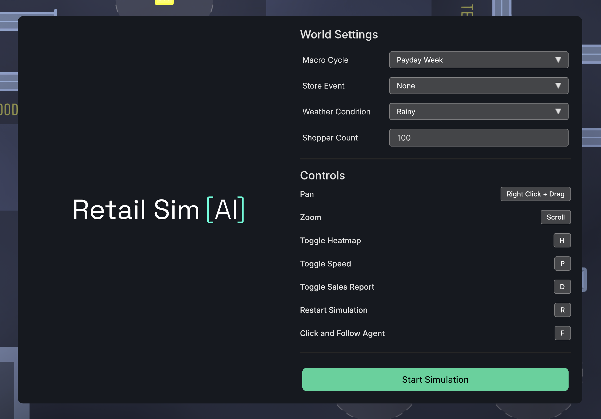

<p className='text-center'>World settings in the Store Simulator.</p>

### Heatmap

Using the simulation data, I can generate realtime heatmaps that show the areas of the store that are most frequently visited by customers. This can help store owners identify high traffic areas and optimize product placement.  
Conversely, these heatmaps can also help identify areas of the store that are underutilized and may need to be redesigned to improve customer flow and engagement.  
Other than identifying high-traffic areas, the heatmap can also be used to identify areas of the store that are most likely to generate impulse purchases.  

Following are the heatmaps generated from the simulation data. The first heatmap shows the initial customer flow in the store, while the second heatmap shows the final customer flow at the end of the simulation. The heatmaps are color-coded, with red areas (not visible in following screenshots) indicating high traffic and blue areas indicating low traffic.

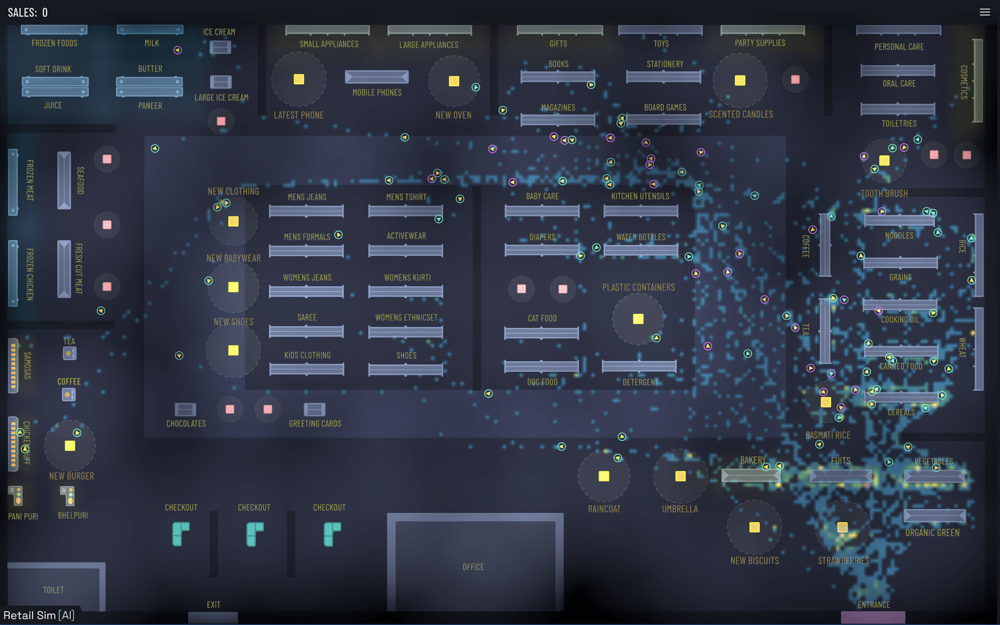

<p className='text-center'>Initial heatmap showing customer flow</p>

<br/>

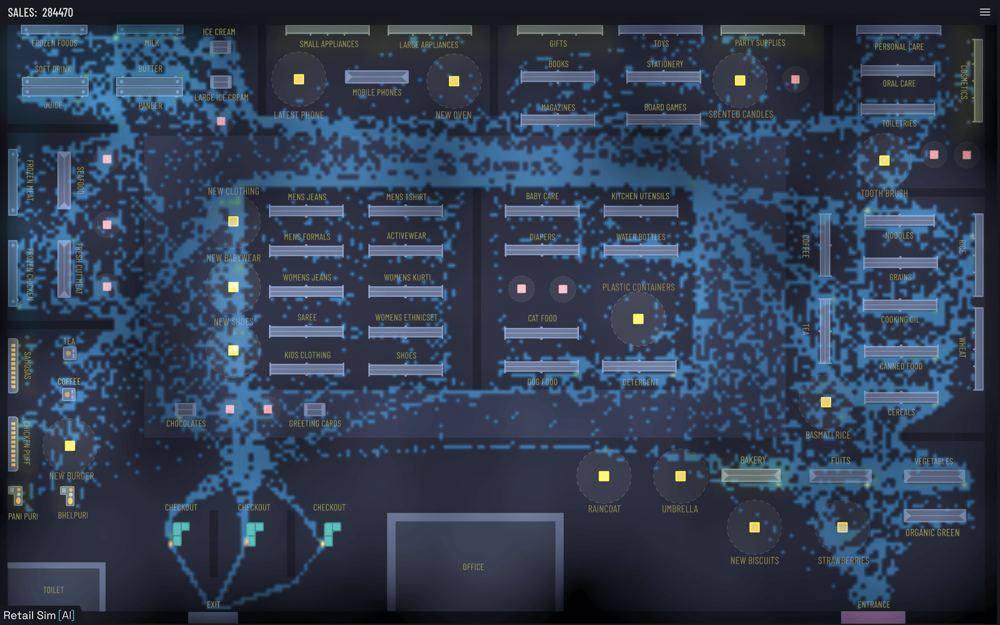

<p className='text-center'>Final heatmap showing customer flow</p>

### Product Placement Optimization

At a high level, store products can be grouped into three categories:

- **Planned products**: items customers already intend to buy, usually from known shelf locations.
- **New launch products**: items that need strong visibility to attract attention.
- **Impulse products**: items placed to trigger unplanned purchases.

Planned products usually have more predictable sales, because customers actively seek them out and buy them regardless of exact placement.
New launch products, however, benefit most from high-traffic, high visibility zones, where exposure directly improves sales.
Impulse products depend heavily on placement and should appear in areas where shoppers naturally pause or pass often, such as checkout counters and other busy sections.

The video below demonstrates how the promotional product placement works in the Store Simulator. It shows how the agents interact with the promotional product placement and how it affects their purchasing behavior.  
It also shows how the placement boundary is dynamically resizing based on nearby shopper density to represent changing visibility effects. When more shoppers gather around the placement, its effective size contracts; when fewer shoppers are nearby, it expands. This helps model how crowding influences attention and purchasing behavior.

<iframe
  width='100%'
  height='900'
  src="https://www.youtube.com/embed/OAo26BQvR_w?si=7ErpfuMOyBF0ArSL"
  title="Product Placement Optimization"
  className='blog-wide-section google-slides'
  frameBorder="0"
  allow="accelerometer; autoplay; clipboard-write; encrypted-media; gyroscope; picture-in-picture; web-share" referrerPolicy="strict-origin-when-cross-origin" allowFullScreen>
</iframe>

### Checkout Congestion Analysis

The simulation can also analyze checkout congestion and identify areas where customers may experience long wait times. This can help store owners optimize the checkout process and improve customer satisfaction. By analyzing the checkout data, I can determine the most effective number of checkout counters to open and the best locations for placing them.

Following is a video that demonstrates how the Store Simulator analyzes checkout congestion and identifies areas where customers may experience long wait times. It also shows how the simulation can be used to optimize the checkout process and improve customer satisfaction.

By looking at the video, one can infer that the checkout congestion is high. Using this data, one can optimize the checkout process by adding more checkout counters based on the time of day, day of the week, and season. This will help reduce wait times and improve customer satisfaction.

<iframe
  width='100%'
  height='900'
  src="https://www.youtube.com/embed/fi1svO-MtWI?si=7qWQ7h6IFxgH3ZbE"
  title="Checkout Congestion Analysis"
  className='blog-wide-section google-slides'
  frameBorder="0"
  allow="accelerometer; autoplay; clipboard-write; encrypted-media; gyroscope; picture-in-picture; web-share" referrerPolicy="strict-origin-when-cross-origin" allowFullScreen>
</iframe>

### Sales Analysis

The simulation can also analyze sales data and provide insights into customer purchasing behavior. This includes identifying the most popular products, analyzing sales trends, and determining the effectiveness of promotional campaigns.  
By analyzing the sales data, I can determine the most effective pricing strategies and promotional tactics to maximize revenue.  
Currently, in my project, I have only implemented totals for each product, but one can easily extend this to include more detailed sales data, such as sales by time of day, day of the week, and season. This will help store owners make data-driven decisions about pricing, promotions, and product placement.

Following is a screenshot of the sales analysis data recorded in the simulation. The data shows the total sales for each product in the store, as well as the total revenue generated by the store.

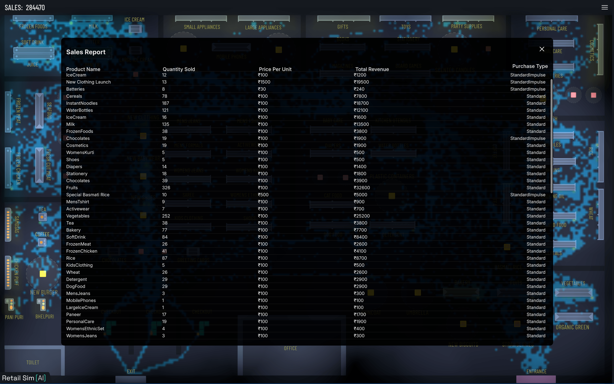

<p className='text-center'>Sales analysis in the Store Simulator.</p>

### Customer Telemetry Data

I added a telemetry system that records the behavior of each virtual shopper in the simulation. It contains their shopping list, impulse favorites, realtime budget, mood, and other relevant data.  This data can be used to analyze customer behavior and identify areas for improvement in the store layout and product placement.  
The telemetry data can also be used to create a more personalized shopping experience for customers by analyzing their purchasing behavior and preferences.  
Following is a screenshot of the telemetry data recorded for a virtual shopper in the simulation. Check the Shopper Agent type and its corresponding shopping list, impulse favorites, realtime mood and budget. Also check the history of the decisions made by the shopper during the simulation.

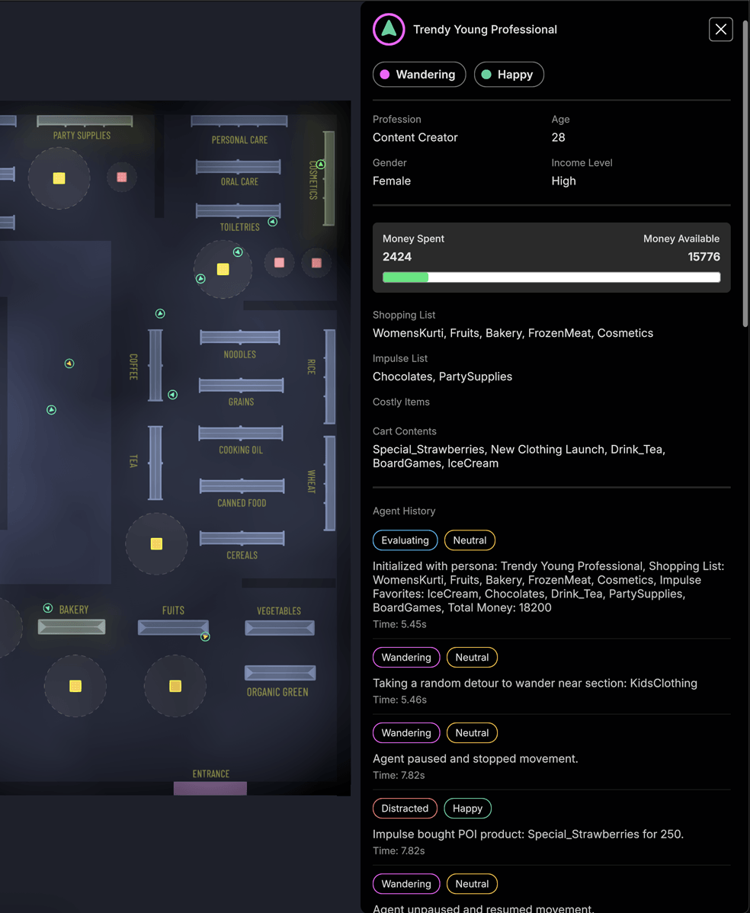

<p className='text-center'>Customer telemetry data in the Store Simulator.</p>

## Building the Store Environment

### Prototyping & Layout Design

Following are some of the rough sketches and prototypes created during the development process.

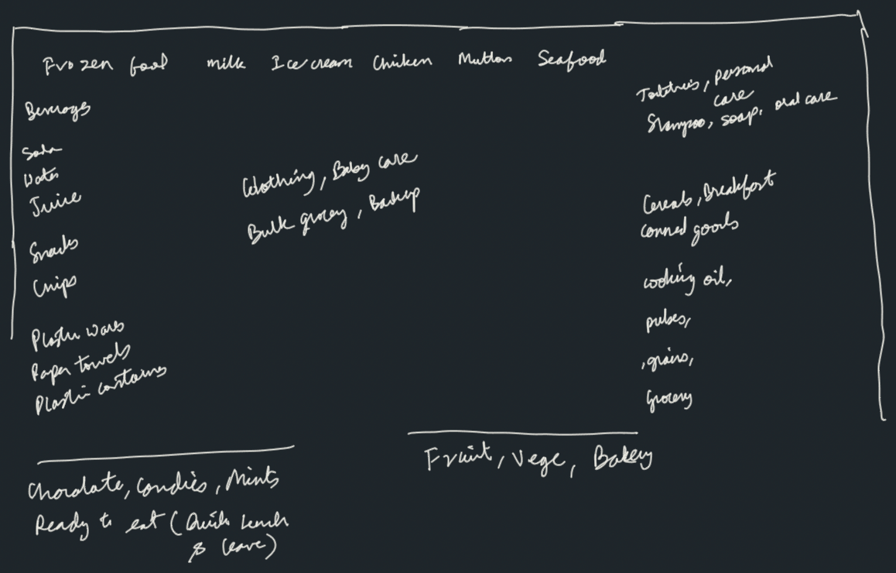

<p className='text-center'>Rough sketch of the store items.</p>

<br />

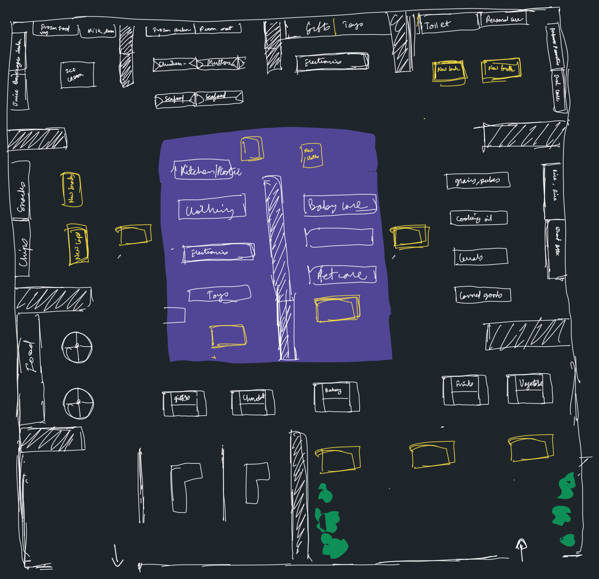

<p className='text-center'>Rough sketch of the store layout.</p>

<br />

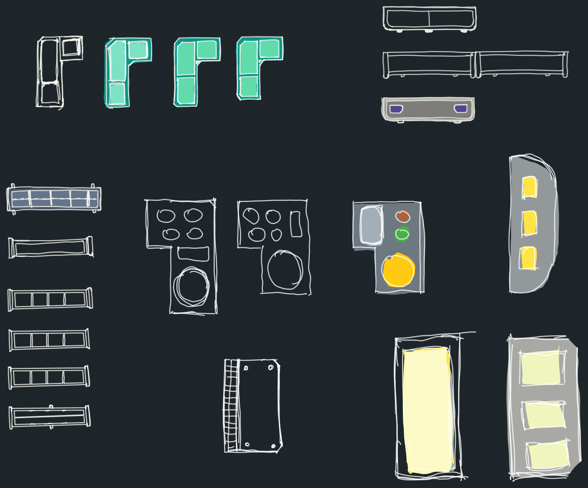

<p className='text-center'>Asset design ideation process.</p>

<br />

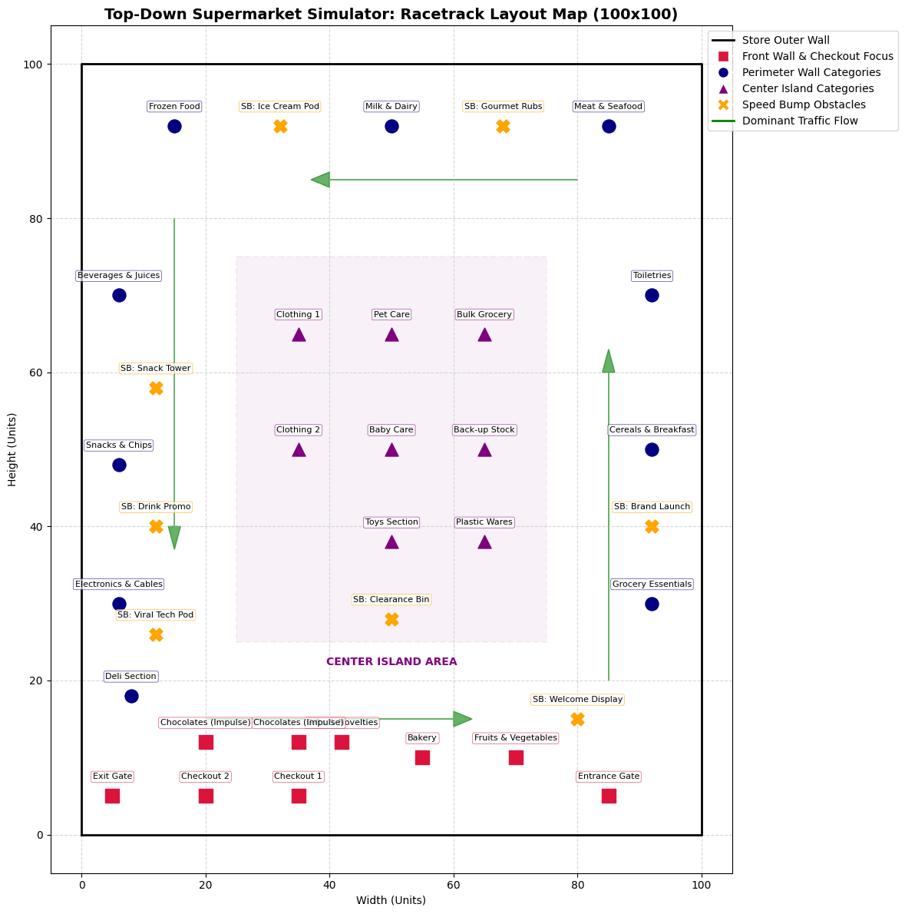

<p className='text-center'>Slightly more detailed layout sketch.</p>

When using the product in the real world, the initial layout will be provided by the store owner, which will be used to create a digital twin of the store in Unity3D. The store owner can then use the Store Simulator to test different layouts and product placements to optimize sales and customer satisfaction.

### Modular Asset Creation

Following assets were designed in Figma and imported into Unity3D. The assets include shelves, displays, checkout counters, and other fixtures in the store. The assets were designed to be modular and reusable so that they can be easily rearranged to create different store layouts.

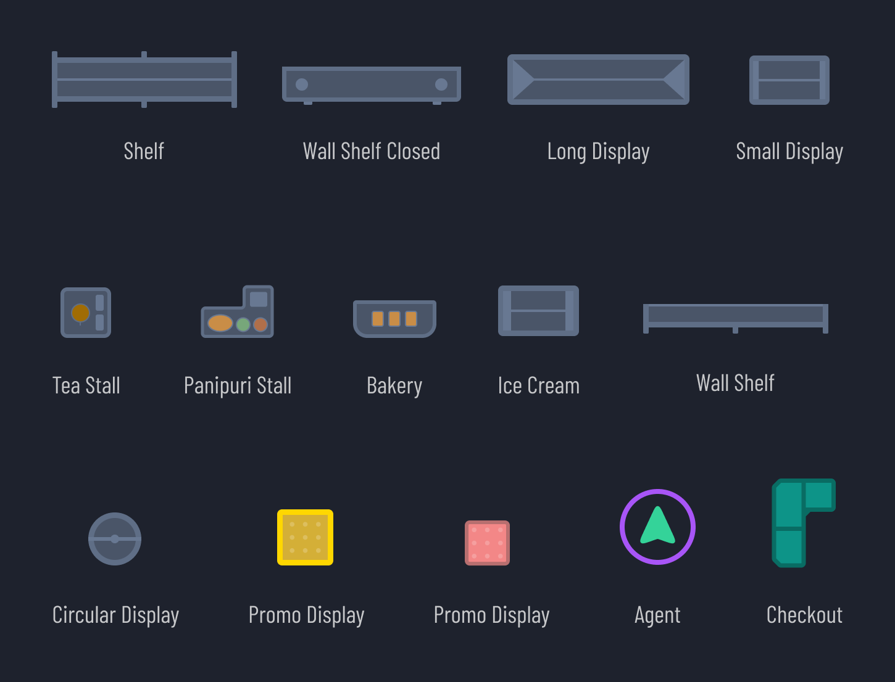

Inside Unity3D, one can use 9-slice scaling to resize the assets without losing quality. This allows us to create variable shelf sizes and display areas without having to create new assets for each size.

<Alert title='INFO' variant='info'>
  **What is 9-slice scaling?**  
   9-slice scaling is a technique used in computer graphics to resize images without distorting the corners. It divides an image into nine sections: four corners, four edges, and a center. The corners are not scaled, the edges are scaled in one direction, and the center is scaled in both directions. This allows for resizing of images while maintaining the integrity of the corners and edges. You can read more about 9-slice scaling [here](https://en.wikipedia.org/wiki/9-slice_scaling).
</Alert>

### Store Layout Design

Following is the video that showcases how to use Unity3D to design the layout of the store.  
_Watch the video at 2x speed._

<iframe
  width='100%'
  height='900'
  src="https://www.youtube.com/embed/KQNrGoDF4cM?si=puYvAK-pdVnoNxZP"
  title="Store Layout Design"
  className='blog-wide-section google-slides'
  frameBorder="0"
  allow="accelerometer; autoplay; clipboard-write; encrypted-media; gyroscope; picture-in-picture; web-share" referrerPolicy="strict-origin-when-cross-origin" allowFullScreen>
</iframe>

## Technical Deep Dive

In the previous sections, we looked at how features like heatmaps and dynamic product placement benefit store managers. Below, we take a look at the technical architecture that powers these features, including how synthetic data is generated, how the Unity3D engine simulates shopper behavior, and how telemetry data is collected and analyzed.

### System Diagram

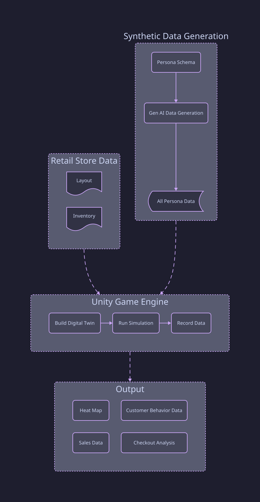

Let's go into detail about each component of the architecture diagram in the following sections.

### Synthetic Data Generation

This component is responsible for generating synthetic data that simulates human behavior in the virtual store. It uses Generative AI to create a set of personas that represent different types of customers, each with their own shopping habits and preferences. This is what drives the virtual shoppers.  

>_Why do we need synthetic data generation?_

- Real customer behavior data in retail stores is difficult and expensive to collect, yet it is critical for understanding how shoppers interact with store layouts.
- Generative AI helps simulate realistic human behavior in a virtual store by creating personas with distinct shopping habits and preferences.
- Each persona represents a different customer type, and together they are used to simulate how shoppers move through layouts and make purchase decisions.
- While collecting real-world behavioral data is ideal, practical constraints made persona-based synthetic data generation the better approach for this project.
- Persona-driven simulation provides both average behavioral patterns across groups and insights into how different customer segments behave differently.

If I had to generate Persona data a couple of years back, I would have used random data generation techniques or Python libraries like [Faker](https://pypi.org/project/Faker/) to generate synthetic data.

**Code Snippet for Generating Synthetic Data**

Follow is the code snippet to generate synthetic data using Generative AI. The code is written in Python and uses OpenAI's GPT-4o-mini API to generate synthetic data with temperature set to 0.7 to allow for some randomness in the generated data. The code generates 20 personas per archetype to reach a goal of 100 personas.

```python
# 1. Define distinct themes for each loop iteration to force demographic diversity. This ensures that each batch of personas has a unique focus, such as students, professionals, families, etc.
archetypes = [
    "Students and young adults living on a budget, nocturnal habits, love snacks and instant food.",
    "Working professionals and software engineers, high budget, short on time, looking for quick meals or premium items.",
    "Large families and parents shopping for household essentials, bulk quantities, high patience but strict budgets.",
    "Fitness enthusiasts and health-conscious individuals, high preference for fresh veggies, dairy, and structured routines.",
    "Elderly citizens or retired folks, shopping early in the morning, high patience, slower moving, traditional cooking ingredients.",
    "Bargain hunters and deal seekers, low budget, high browsing tendencies, love discounts and promotions.",
    "Impulse buyers and trend followers, high budget, high likelihood of unplanned purchases, easily swayed by attractive displays and new products.",
    "People who are interested in buying clothes, shoes, and accessories, medium budget, fashion-conscious, looking for seasonal trends and stylish items.",
]
```

The above code snippet defines a list of archetypes that represent different types of customers. Each archetype has a unique focus, such as students, professionals, families, etc. The code will generate 20 personas per archetype to reach a goal of 100 personas. This is important because it ensures that the synthetic data is diverse and representative of different types of customers. I ran this code twice to generate a total of 200 personas.

<ExpandableSeeMore>

```python
personas_per_batch = 20 

# Sample inventory data for the store and food court. This data will be used to generate realistic shopping lists for the personas.
to_eat = """
- Pizza
- Burger
- Sandwich
"""

products = """
- OrganicGreen
- Milk
- Fruits
"""

for i, archetype_focus in enumerate(archetypes):    
    prompt = f"""
    You are generating a batch of {personas_per_batch} distinct customer personas for a 2D supermarket simulation game.

    PRIMARY BATCH FOCUS
    Create personas that primarily match this demographic direction:
    {archetype_focus}

    UNIQUENESS RULES
    - Make names, exact ages, budgets, and shopping lists unique within this batch.
    - Keep each persona distinct in behavior, lifestyle, and purchase intent.

    ROLE
    You are a behavioral data engine for a retail store layout simulator.
    Your job is to generate diverse, hyper-realistic customer personas using explicit demographic context and the provided store inventory.

    INPUT STORE INVENTORY
    {products}

    FOOD COURT INVENTORY
    {to_eat}

    OUTPUT REQUIREMENT
    Generate a single customer profile that strictly conforms to the provided JSON schema.
    All demographics, physical parameters, behavioral attributes, and grocery item lists must feel psychologically realistic and internally consistent.

    GENERATION CONSTRAINTS
    1. ITEM MATCHING
    Every entry item inside "base_shopping_list" and "base_impulse_favorites" must be an exact string match from the provided input store inventory. Add realistic quantities for each item.
    Do not invent items.

    2. LIST EXCLUSION
    Items in "base_shopping_list" must not overlap with or be duplicated inside "base_impulse_favorites".

    3. PHYSICAL REALISM
    Calibrate "baseline_physics" to match the demographics.
    - A "TimeSensitive" professional or student in a rush should have a high base_speed (4.0-4.5) and higher avoidance priority (lower integer values like 25).
    - A "Cautious" or elderly shopper should have a lower base_speed (2.0-2.8) and lower priority (higher integer values like 65).

    4. FINANCIAL REALISM
    Match "base_total_money" to the demographic's "income_level".
    - High income: 15000-20000
    - Low income: 500-2000

    5. PSYCHOLOGICAL PROBABILITY CALIBRATION
    - "base_random_browse_probability" controls detours.
        - If agent_type is "WindowShopper", set this high (0.60 to 0.85).
        - If primary_trait is "TimeSensitive", set this near zero (0.0 to 0.05).
    - "base_impulse_probability" controls unplanned spending.
        - If agent_type is "ImpulseBuyer" or primary_trait is "Impulsive", set this high (0.50 to 0.80).
        - If agent_type is "BargainHunter" or primary_trait is "BudgetConscious", set this very low (0.0 to 0.10).
    6. FOOD COURT INCLUSION
    - Include at least one item from the FOOD COURT INVENTORY in their "base_shopping_list" or "base_impulse_favorites" to make the persona feel more realistic and human.

    TARGET PROFILE DIRECTION
    Create a profile for a [INSERT TARGET DEMOGRAPHIC HERE, e.g., "24-year-old female Software Engineer with a High income who shops quickly after work hours."]
    """
```

</ExpandableSeeMore>  

Above code snippet defines a prompt that will be used to generate synthetic data using Generative AI. The prompt includes instructions for generating personas that match the demographic direction, uniqueness rules, role, input store inventory, output requirements, and generation constraints. The prompt also includes a target profile direction that specifies the type of persona to be generated.

Following is a sample output of the above code snippet. The output is a JSON object that represents a customer persona.

**Sample Persona Data:**

```json
{
    "persona_name": "Quick Snack Buyer",
    "demographics": {
        "age": 19,
        "profession": "Community College Student",
        "income_level": "Low",
        "gender": "Female"
    },
    "agent_type": "Regular",
    "primary_trait": "BudgetConscious",
    "baseline_physics": {
        "base_speed": 3.5,
        "base_acceleration": 6.0,
        "base_avoidance_priority": 55
    },
    "base_total_money": 850,
    "psychological_profile": {
        "base_random_browse_probability": 0.1,
        "base_impulse_probability": 0.05
    },
    "base_shopping_list": [
        { "item_name": "FrozenFoods", "quantity": 2 },
        { "item_name": "Milk", "quantity": 1 },
        { "item_name": "Cereals", "quantity": 1 },
        { "item_name": "InstantNoodles", "quantity": 5 },
        { "item_name": "Chocolates","quantity": 2 },
        {"item_name": "WaterBottles","quantity": 3 },
        { "item_name": "IceCream", "quantity": 1 }
    ],
    "base_impulse_favorites": [
        { "item_name": "Eat_Panipuri", "quantity": 1 },
        { "item_name": "Eat_Bhelpuri", "quantity": 2 },
        { "item_name": "Chocolates", "quantity": 1 },
        { "item_name": "Magazines", "quantity": 1 }
    ]
},
{
    "persona_name": "Health-Conscious Grandfather",
    "demographics": {
        "age": 80,
        "profession": "Retired Doctor",
        "income_level": "High",
        "gender": "Male"
    },
    "agent_type": "Regular",
    "primary_trait": "Cautious",
    "baseline_physics": {
        "base_speed": 2.3,
        "base_acceleration": 5.4,
        "base_avoidance_priority": 85
    },
    "base_total_money": 19000,
    "psychological_profile": {
        "base_random_browse_probability": 0.11,
        "base_impulse_probability": 0.04
    },
    "base_shopping_list": [
        { "item_name": "OrganicGreen", "quantity": 5 },
        { "item_name": "Fruits", "quantity": 6 },
        { "item_name": "Vegetables", "quantity": 5 },
        { "item_name": "Milk", "quantity": 2 },
        { "item_name": "Cereals", "quantity": 3 },
        { "item_name": "CookingOil", "quantity": 1 },
        { "item_name": "Tea", "quantity": 1 }
    ],
    "base_impulse_favorites": [
        { "item_name": "Books", "quantity": 1 },
        { "item_name": "Stationery", "quantity": 1 }
    ]
},

```

As you can see, the data includes information about the persona's demographics, agent type, primary trait, baseline physics, base total money, psychological profile, base shopping list, and base impulse favorites.

If you notice the persona characteristics, you will see that they look realistic and believable. For example, the "**Quick Snack Buyer**" persona is a 19 year old female community college student with a low income level. She has a budget-conscious primary trait and a low impulse probability, which means she is less likely to make unplanned purchases. Her shopping list includes items that are affordable and easy to prepare, such as frozen foods, milk, cereals, instant noodles, chocolates, water bottles, and ice cream. Her impulse favorites include panipuri, bhelpuri, chocolates, and magazines.  
In contrast, the "**Health Conscious Grandfather**" persona, who is an 80 year old retired doctor with a high income level. He has a cautious primary trait and a low impulse probability, which means he is less likely to make unplanned purchases. His shopping list includes items that are healthy and nutritious, such as organic greens, fruits, vegetables, milk, cereals, cooking oil, and tea. His impulse favorites include books and stationery.  
This is the power of Gen AI, which can generate realistic and believable personas that can be used to simulate customer behavior in a virtual store.

You can find all the personas generated here [supermarket_100_personas.json](https://raw.githubusercontent.com/gautamnaik1994/StoreSimulator/refs/heads/main/Assets/Data/supermarket_100_personas.json).

This data is then stored in JSON format and is imported into the Unity3D Game Engine to create virtual shoppers that behave realistically based on their personas.

### Retail Store Data

This component is responsible for collecting data on the layout and inventory of the store. This data is used to create a virtual representation of the store layout in the simulation tool.
Any retail store owner can provide the layout and inventory data of their store. The layout data includes the placement of shelves, displays, and other fixtures in the store.

### Unity3D Game Engine

Unity3D is a cross-platform game engine developed by Unity Technologies. It is widely used for creating 2D and 3D games, as well as interactive applications and simulations. You can read more about Unity3D [here](https://unity.com/).

This component is responsible for building the digital twin of the store, running simulations, and recording data on customer behavior, sales, and checkout performance. This is the core of the simulation platform. The Unity Game Engine allows us to create a realistic representation of the store layout and simulate customer behavior in real time. I will go into more detail in the upcoming sections.

## Simulation Design

In the previous sections, we looked at the core components of the simulation platform. In this section, we will look at how the simulation is designed and how it works.

### Simulation Parameters

Before starting the simulation, one need to define the parameters of the simulation. For this demo, I have defined three parameters:

- **MacroCycle** - Has the value of "Payday week", "End of Month", "Festive Season"
- **StoreEvent** - Has the value of "Flash Sale Active", "Panic Buying Alert"
- **WeatherCondition** - Has the value of "Clear", "Rainy", "Hot", "Cold"

```csharp
public float GetGlobalSpeedModifier()
{
    float modifier = 1.0f;

    // Weather impacts walking speeds (e.g., people escaping rain stroll less, hot weather slows people down)
    if (currentWeather == WeatherCondition.Rainy) modifier *= 1.15f;
    if (currentWeather == WeatherCondition.Hot) modifier *= 0.85f;

    if (activeEvent == StoreEvent.PanicBuyingAlert) modifier *= 1.3f;
    if (activeEvent == StoreEvent.None && currentCycle == MacroCycle.FestiveSeason) modifier *= 0.75f; // Leisurely holiday stroll

    return modifier;
}

public float GetGlobalBrowseTimeModifier()
{
    if (currentCycle == MacroCycle.EndOfMonth) return 1.6f;      // Comparing prices carefully (Budget Conscious)
    if (currentCycle == MacroCycle.FestiveSeason) return 1.25f;  // Higher dwell times looking for gifts
    if (activeEvent == StoreEvent.PanicBuyingAlert) return 0.4f; // Direct to shelf, grab, and go
    return 1.0f;
}

public float GetGlobalPurchaseLikelihoodModifier()
{
    float modifier = 1.0f;
    if (currentCycle == MacroCycle.PaydayWeek) modifier *= 1.35f;      // High disposable income injection
    if (currentCycle == MacroCycle.EndOfMonth) modifier *= 0.7f;       // Tight wallets
    if (activeEvent == StoreEvent.FlashSaleActive) modifier *= 1.6f;   // FOMO mechanics triggered
    return modifier;
}

public float GetBudgetModifier()
{
    if (currentCycle == MacroCycle.PaydayWeek) return 1.25f;
    if (currentCycle == MacroCycle.EndOfMonth) return 0.80f;
    return 1.0f;
}
```

As shown in the code above, these settings change how shoppers behave in the store by adjusting their walking speed, browsing time, likelihood of buying items, and available budget.

The simulation parameters affect shopper behavior in several key ways:

- **Payday Week**: Shoppers have higher disposable income and tend to purchase more items.
- **End of Month**: Tighter budgets lead to cautious spending, higher dwell times for price comparisons, and fewer total purchases.
- **Festive Season**: Holiday shopping encourages more gift browsing and higher overall purchases.
- **Flash Sale**: Triggers fast, unplanned impulse buys due to urgency.
- **Panic Buying Alert**: Drives shoppers directly to shelves for essentials, skipping general browsing.
- **Weather Effects**: Rainy or hot weather increases movement speed or shortens store visits, whereas clear or cold days promote longer, more relaxed visits.

While adding more factors creates a more accurate simulation, it also makes the model more complex to manage.

### Shopper AI

Each virtual shopper has a fixed shopping list and a set of impulse favorites. The virtual shoppers will make decisions based on their shopping list, impulse favorites, and the parameters defined in the simulation. The virtual shoppers will also make decisions based on their psychological profile. For example, a virtual shopper with a high impulse probability is more likely to make impulse purchases than a virtual shopper with a low impulse probability.

Every second, the agent will use a path-finding algorithm like A*(A-star) to navigate the store layout. The agent will first check if the items on its shopping list are available in the store. If the items are available, the agent will navigate to the location of the item and add it to their cart. If the items are not available, the agent will skip that item and move on to the next item on their shopping list.  
I will discuss the AI logic in detail in the upcoming sections.

<Alert title='INFO' variant='info'>
  _What is A* Pathfinding?_  
  A* (A-star) is a popular path-finding and graph traversal algorithm used in computer science and artificial intelligence. It is widely used in video games, robotics, and other applications where finding the shortest path between two points is essential. Since A-star is a very common algorithm, most game engines include a built-in implementation of it. The navigation system allows developers to define walkable areas in a 3D environment and automatically generates a navigation mesh that agents can use to find paths around obstacles.
  You can read more about A* Pathfinding [here](https://en.wikipedia.org/wiki/A*_search_algorithm).  
</Alert>

**How Our Shopper AI Thinks ?**

In our Store Simulator, each customer is not just moving randomly. The `AgentMovement` module's logic models a believable shopper that continuously evaluates goals, budget, mood, and environment constraints before deciding what to do next.

Following content explains exactly how the agent decides what to buy next, when to detour, and when to head to checkout.

#### Agent State Machine

At the core, it is a finite state machine with the following states:

- Evaluating
- NavigatingToShelf
- BrowsingShelf
- Wandering
- WaitingToQueue
- GoingToCheckout
- CheckingOut
- Leaving

In this simulation, the behavior is state driven. The most important state is `Evaluating`, where the **brain** runs `CentralizeDecisionMaking` on a throttled interval.
Based on the decision outcome, the agent transitions to the next state, such as `NavigatingToShelf` or `GoingToCheckout`. This keeps the agent's behavior organized and predictable while allowing for complex decision making.

<Alert title='INFO' variant='info'>
  **What is a Finite State Machine?**  
  A finite state machine (FSM) is a computational model used to design algorithms and systems. It consists of a finite number of states, transitions between those states, and actions that occur based on those transitions. FSMs are widely used in computer science, engineering, and game development to model the behavior of systems that can be in one of a limited number of states at any given time. You can read more about FSMs [here](https://en.wikipedia.org/wiki/Finite-state_machine).
</Alert>

#### Agent Persona

As part of the simulation setup, I created around 200 personas with different shopping habits and preferences. This process has been discussed in detail in the previous section. Each persona has a set of traits that influence their behavior in the store. These traits include:

- Planned shopping list
- Impulse favorites
- Budget
- Physical traits (speed, acceleration, avoidance priority)
- Psychology (impulse and random browsing probabilities)

So two agents in the same store can behave very differently because their traits and modifiers alter:

- how likely they are to impulse buy,
- how fast they move,
- and how strict they are with budget pressure.

#### Decision Pipeline

The most important state is `Evaluating`, where the agent runs a decision pipeline to determine the next action. Every evaluation cycle, the agent follows a layered decision process:

**Mood and psychology update**

- **DynamicMoodEvaluation** updates fatigue/frustration/patience driven mood.
- **ApplyMoodSideEffects** changes behavior (speed, impulse tendency, list abandonment in impatience).  

**Hard stop checks**

- If shopping list is empty: go to queue holding area.
- If money is low (&lt;= 20% baseline): stop shopping and go to the queue.
- If money is moderately low (&lt;= 40% and &gt; 20%): reduce impulse probability.  

**Detour roll**

- Just like real shoppers, this allows for spontaneous browsing and discovery of new items.
- This simulates window shopping and non-linear shopper paths.  

**Build candidate targets**

- Planned items positions are added to the agent's destination queue.
- Product sections that are occupied by other shoppers are skipped to avoid congestion via cooldown.
- If all are blocked, cooldowns reset as recovery behavior.

**Rank nearby options**

- Uses NavMesh path length ranking rather than straight-line distance.
- Chooses top candidates to reduce wasted walking.

**Impulse interception**

- If the impulse condition passes, a favorite impulse item is inserted at the **front** of the queue.
- Planned route is preserved behind it, so impulse buys feel opportunistic, not chaotic.

**Commit to next move**

- After all constraints are applied, the agent commits to the next target and switches to `NavigatingToShelf`.

#### Next Target Selection

The buy next outcome is not a single random draw. It emerges from:

- **Need-based intent**: planned `shoppingList`
- **Opportunity**: impulse intercepts
- **Reachability**: NavMesh complete paths only
- **Distance cost**: path length ranking
- **Inventory friction**: full shelf cooldown penalties
- **Financial constraints**: affordability and remaining budget
- **Emotional state**: mood impacts pace and impulse behavior

So the next item is effectively the highest feasibility, highest urgency target after all constraints are applied.

> I know the logic of the agent determining the next closest shelf may not match the real-world behaviour of shoppers, as real people might not calculate distances perfectly, but it is a good approximation for the purpose of this simulation. The goal is to create a believable shopping experience, not to perfectly replicate human behavior.

#### Shelf Interaction

When arriving at shelf:

- Agent waits a random browse duration(2-5 seconds).
- If item price &lt;= remaining money, purchase succeeds:
  - removes from planned and/or impulse list
  - adds to cart
  - deducts money
- If unaffordable:
  - item is tracked in `CostlyItems`
  - history logs failed purchase intent

This is important because **intent to buy** and **ability to buy** are separate, which creates believable failed purchase stories.

#### Queue & Checkout

Once done or budget is low, the agent heads to checkout:

- Moves to holding area.
- Periodically checks for the best checkout line.
- Joins the least loaded non-full checkout queue.

If lines are full, the agent waits and re-evaluates periodically, simulating real-world patience and frustration. It then proceeds to checkout when the line is available.

#### Agent Mood

The agent's mood is a dynamic state that influences their behavior and decision making process. It can shift based on various factors such as the current shopping situation, the items in their cart, and their overall financial status.  
Following is the code snippet that shows how the agent's mood is evaluated and how it affects their behavior.

<ExpandableSeeMore>

```csharp
    private void DynamicMoodEvaluation()
    {
        // Accumulate base fatigue over time
        fatigue += Time.deltaTime * 0.005f;

        // Determine mood based on state mixtures
        if (frustration > 0.7f && patience < 0.2f)
        {
            ChangeMood(AgentMood.Impatient);
        }
        else if (frustration > 0.4f)
        {
            ChangeMood(AgentMood.Frustrated);
        }
        else if (fatigue > 0.8f || CostlyItems.Count > 0) // If the agent is exhausted or has too many costly items
        {
            ChangeMood(AgentMood.Sad); // Simulating exhausted/low energy
        }
        else if (cartItems.Count > 3 && frustration < 0.2f)
        {
            ChangeMood(AgentMood.Happy);
        }
        else
        {
            ChangeMood(AgentMood.Neutral);
        }
        ApplyMoodSideEffects();
    }

    private void ApplyMoodSideEffects()
    {
        switch (currentMood)
        {
            case AgentMood.Impatient:
                // Impatient agents walk faster but drop items from their list early to checkout faster!
                agent.speed = baselineSpeed * 1.3f;
                if (shoppingList.Count > 1 && Random.value < 0.01f)
                {
                    string abandonedItem = shoppingList.Keys.ToArray()[Random.Range(0, shoppingList.Count)];
                    shoppingList.Remove(abandonedItem);
                    agentHistory.Add(new AgentHistoryEntry(Time.time, currentState, $"[Loss of Sale] Abandoned looking for {abandonedItem} due to impatience.", currentMood));
                }
                break;

            case AgentMood.Frustrated:
                // Frustrated agents stop impulse buying completely
                agentHistory.Add(new AgentHistoryEntry(Time.time, currentState, $"[Impulse Block] Impulse buying disabled due to frustration.", currentMood));
                impulseProbability = 0f;
                break;

            case AgentMood.Happy:
                // Happy agents buy more impulses and walk at a leisurely pace
                agent.speed = baselineSpeed * 0.9f;
                impulseProbability = originalImpulseProbability * 1.5f;
                agentHistory.Add(new AgentHistoryEntry(Time.time, currentState, $"[Impulse Boost] Increased impulse buying probability to {impulseProbability} due to happiness.", currentMood));
                break;
        }
    }
```

</ExpandableSeeMore>

The `DynamicMoodEvaluation` function continuously assesses these factors and updates the agent's mood accordingly. The `ApplyMoodSideEffects` function then adjusts the agent's behavior based on their current mood, influencing speed, impulse buying tendencies, and shopping list management.

For example, an impatient agent may move faster but abandon items from their shopping list, while a happy agent may have an increased likelihood of making impulse purchases. This creates a more realistic and engaging simulation of shopper behavior.

This is important because it allows the simulation to capture the emotional state of shoppers and how it affects their purchasing behavior. By modeling shopper mood, one can better understand how different factors, such as frustration or happiness, can influence shopping decisions and ultimately impact sales and customer satisfaction.

While frustration tracking is structured in the code state, future iterations can tie it directly to long checkout queue wait times, blocked aisles, budget constraints, or repeated failed purchase attempts. This would allow the simulation to dynamically adjust shopper mood based on real time store conditions, providing even more nuanced insights into customer behavior.

Just like real-world shoppers, mood can also change when a shopper is unable to afford an item on their shopping list. This adds another layer of realism to the simulation, as it captures the emotional impact of financial constraints on shopper behavior.

### Performance & Scalability

Simulating hundreds of individual shopper agents in real time presents performance challenges under traditional Unity single core processing, which can experience significant frame rate drops and CPU bottlenecks as agent counts increase. Thankfully, my system was able to handle the simulation of hundreds of agents without performance degradation.

But in future, if I want to scale the simulation to thousands of agents, I will need to use more advanced techniques to optimize performance. One such technique is to use Unity's Entity Component System (ECS) and the Data-Oriented Technology Stack (DOTS) to improve performance and scalability.  
According to Unity, this system utilizes all the cores available on the CPU, which allows for better performance and scalability. But the complexity of the system increases significantly.

<Alert title='INFO' variant='info'>
  **What are ECS and DOTS?**  
  The Entity Component System (ECS) and Data-Oriented Technology Stack (DOTS) are architectural patterns and tools in Unity designed for high performance data processing. Unlike traditional object-oriented programming (where data and behavior are bundled in objects), ECS separates data (components) from logic (systems) and lays data out sequentially in memory. This maximizes CPU cache efficiency and allows multi-threading across all available CPU cores, making it ideal for simulating thousands of autonomous agents simultaneously. You can read more about Unity DOTS [here](https://unity.com/dots).
</Alert>

### Key Advantages of This Architectural Approach

By integrating state machines, pathfinding algorithms, adaptive agent logic, and rich diagnostic logging, this framework ensures virtual shoppers act with dynamic, realistic priorities rather than scripted predictability:

- **Behavioral Dynamics:** Combines explicit state-machine transitions with mood-driven adjustments to reflect real-time psychological shifts.
- **Navigation & Contention:** Uses path-aware ranking for movement and cooldown mechanics to gracefully resolve shelf congestion.
- **Agent Diversity & Observability:** Leverages persona variability for diverse decisions while capturing detailed history logs for analytics and debugging.

As a result, agents navigate the virtual store like real human shoppers balancing competing interests rather than automated bots.

## Playable Demo

This project was built in Unity3D. Unity3D games can be exported to most platforms, including WebGL. You can play the demo in your browser by clicking the link below.  
[](https://play.unity.com/en/games/5c21cd7e-2940-493b-a714-44b2ff292e93/retailsimaiweb)

## GitHub Repository

The source code for this project is available on GitHub. You can clone the repository and run the simulation locally. The repository contains all the necessary files and instructions to set up the project in Unity3D.  
[](https://github.com/gautamnaik1994/StoreSimulator)

## Final Thoughts

While this simulation serves as a proof of concept, it effectively demonstrates how virtual modeling can approximate real-world shopper behavior in a retail environment. Store owners can leverage this approach to evaluate layout variations and product placement strategies, ensuring decisions are grounded in visual and behavioral data before committing physical resources. By using Generative AI to create diverse customer personas, the model captures a rich spectrum of shopping habits, allowing teams to test how different demographics interact with a space and make purchasing choices.  

Looking ahead, the platform can expand to support multi-floor retail environments using Unity's Off Mesh Link system to simulate multi-level shopper navigation. Future iterations could also incorporate more complex cognitive behaviors and integrate real-time store telemetry to continuously refine simulation accuracy and further support data-driven retail planning.
